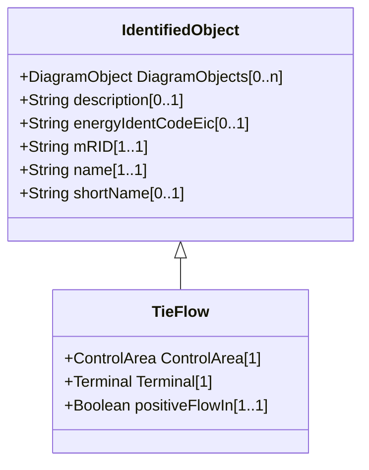

# TieFlow

Defines the structure (in terms of location and direction) of the net interchange constraint for a control area. This constraint may be used by either AGC or power flow.

## Inheritance

<button class="mermaid-enlarge-button">Enlarge Diagram</button>

## Attributes

| Label | Type | Multiplicity | Comment |
|-------|------|--------------|---------|
| ControlArea | [ControlArea](ControlArea.md) | 1 | The control area of the tie flows. |
| Terminal | [Terminal](Terminal.md) | 1 | The terminal to which this tie flow belongs. |
| positiveFlowIn | Boolean | 1..1 | Specifies the sign of the tie flow associated with a control area. True if positive flow into the terminal (load convention) is also positive flow into the control area. See the description of ControlArea for further explanation of how TieFlow.positiveFlowIn is used. |

