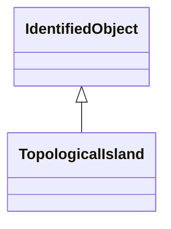

# TopologicalIsland

An electrically connected subset of the network. Topological islands can change as the current network state changes, e.g. due to: - disconnect switches or breakers changing state in a SCADA/EMS. - manual creation, change or deletion of topological nodes in a planning tool. Only energised TopologicalNode-s shall be part of the topological island.

## Inheritance

<button class="mermaid-enlarge-button">Enlarge Diagram</button>

## Attributes

| Label | Type | Multiplicity | Comment |
|-------|------|--------------|---------|
| AngleRefTopologicalNode | [TopologicalNode](TopologicalNode.md) | 1 | The angle reference for the island. Normally there is one TopologicalNode that is selected as the angle reference for each island. Other reference schemes exist, so the association is typically optional. |
| TopologicalNodes | [TopologicalNode](TopologicalNode.md) | 1..n | A topological node belongs to a topological island. |

