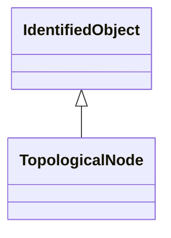

# TopologicalNode

For a detailed substation model a topological node is a set of connectivity nodes that, in the current network state, are connected together through any type of closed switches, including jumpers. Topological nodes change as the current network state changes (i.e., switches, breakers, etc. change state). For a planning model, switch statuses are not used to form topological nodes. Instead they are manually created or deleted in a model builder tool. Topological nodes maintained this way are also called 'busses'.

## Inheritance

<button class="mermaid-enlarge-button">Enlarge Diagram</button>

## Attributes

| Label | Type | Multiplicity | Comment |
|-------|------|--------------|---------|
| AngleRefTopologicalIsland | [TopologicalIsland](TopologicalIsland.md) | 0..1 | The island for which the node is an angle reference. Normally there is one angle reference node for each island. |
| BaseVoltage | [BaseVoltage](BaseVoltage.md) | 1..1 | The base voltage of the topological node. |
| ConnectivityNodeContainer | [ConnectivityNodeContainer](ConnectivityNodeContainer.md) | 1 | The connectivity node container to which the topological node belongs. |
| ConnectivityNodes | [ConnectivityNode](ConnectivityNode.md) | 0..n | The connectivity nodes combine together to form this topological node. May depend on the current state of switches in the network. |
| ReportingGroup | [ReportingGroup](ReportingGroup.md) | 0..1 | The reporting group to which the topological node belongs. |
| SvInjection | [SvInjection](SvInjection.md) | 0..1 | The injection flows state variables associated with the topological node. |
| SvVoltage | [SvVoltage](SvVoltage.md) | 0..1 | The state voltage associated with the topological node. |
| Terminal | [Terminal](Terminal.md) | 1..n | The terminals associated with the topological node. This can be used as an alternative to the connectivity node path to terminal, thus making it unnecessary to model connectivity nodes in some cases. Note that if connectivity nodes are in the model, this association would probably not be used as an input specification. |
| TopologicalIsland | [TopologicalIsland](TopologicalIsland.md) | 0..1 | A topological node belongs to a topological island. |

