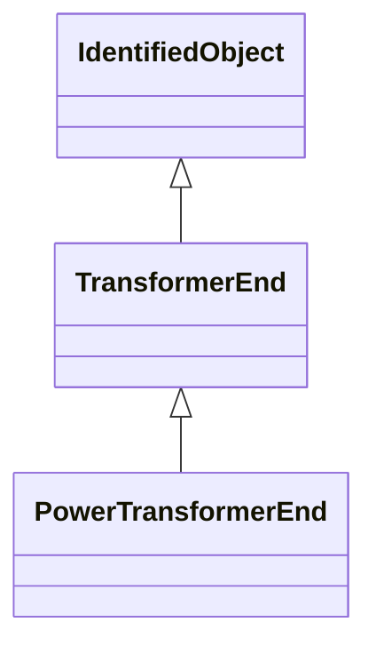

# TransformerEnd

A conducting connection point of a power transformer. It corresponds to a physical transformer winding terminal. In earlier CIM versions, the TransformerWinding class served a similar purpose, but this class is more flexible because it associates to terminal but is not a specialization of ConductingEquipment.

## Inheritance

<button class="mermaid-enlarge-button">Enlarge Diagram</button>

## Attributes

| Label | Type | Multiplicity | Comment |
|-------|------|--------------|---------|
| BaseVoltage | [BaseVoltage](BaseVoltage.md) | 1 | Base voltage of the transformer end. This is essential for PU calculation. |
| PhaseTapChanger | [PhaseTapChanger](PhaseTapChanger.md) | 0..1 | Phase tap changer associated with this transformer end. |
| RatioTapChanger | [RatioTapChanger](RatioTapChanger.md) | 0..1 | Ratio tap changer associated with this transformer end. |
| Terminal | [Terminal](Terminal.md) | 1..1 | Terminal of the power transformer to which this transformer end belongs. |
| endNumber | Integer | 1..1 | Number for this transformer end, corresponding to the end's order in the power transformer vector group or phase angle clock number. Highest voltage winding should be 1. Each end within a power transformer should have a unique subsequent end number. Note the transformer end number need not match the terminal sequence number. |
| grounded | Boolean | 1..1 | (for Yn and Zn connections) True if the neutral is solidly grounded. |
| rground | Float | 0..1 | (for Yn and Zn connections) Resistance part of neutral impedance where 'grounded' is true. |
| xground | Float | 0..1 | (for Yn and Zn connections) Reactive part of neutral impedance where 'grounded' is true. |

