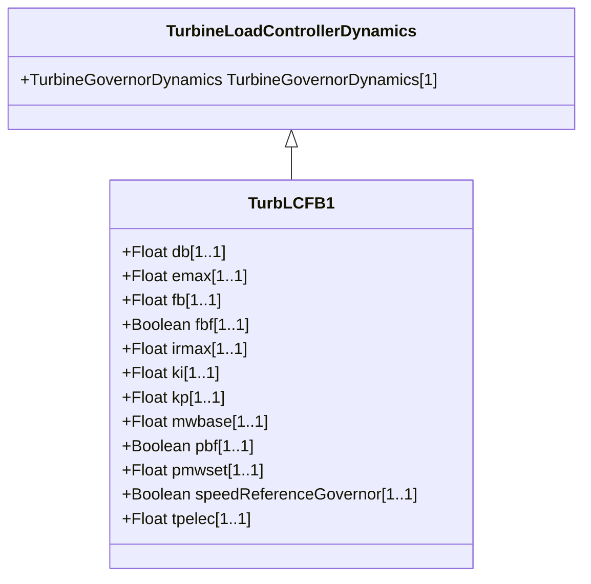

# TurbLCFB1

Turbine load controller model developed by WECC. This model represents a supervisory turbine load controller that acts to maintain turbine power at a set value by continuous adjustment of the turbine governor speed-load reference. This model is intended to represent slow reset 'outer loop' controllers managing the action of the turbine governor.

## Inheritance

<button class="mermaid-enlarge-button">Enlarge Diagram</button>

## Attributes

| Label | Type | Multiplicity | Comment |
|-------|------|--------------|---------|
| db | Float | 1..1 | Controller deadband (db). Typical value = 0. |
| emax | Float | 1..1 | Maximum control error (Emax) (see parameter detail 4). Typical value = 0,02. |
| fb | Float | 1..1 | Frequency bias gain (Fb). Typical value = 0. |
| fbf | Boolean | 1..1 | Frequency bias flag (Fbf). true = enable frequency bias false = disable frequency bias. Typical value = false. |
| irmax | Float | 1..1 | Maximum turbine speed/load reference bias (Irmax) (see parameter detail 3). Typical value = 0. |
| ki | Float | 1..1 | Integral gain (Ki). Typical value = 0. |
| kp | Float | 1..1 | Proportional gain (Kp). Typical value = 0. |
| mwbase | Float | 1..1 | Base for power values (MWbase) (> 0). Unit = MW. |
| pbf | Boolean | 1..1 | Power controller flag (Pbf). true = enable load controller false = disable load controller. Typical value = false. |
| pmwset | Float | 1..1 | Power controller setpoint (Pmwset) (see parameter detail 1). Unit = MW. Typical value = 0. |
| speedReferenceGovernor | Boolean | 1..1 | Type of turbine governor reference (Type). true = speed reference governor false = load reference governor. Typical value = true. |
| tpelec | Float | 1..1 | Power transducer time constant (Tpelec) (>= 0). Typical value = 0. |

