# TurbineGovernorDynamics

Turbine-governor function block whose behaviour is described by reference to a standard model or by definition of a user-defined model.

## Inheritance

```mermaid
classDiagram
    DynamicsFunctionBlock <|-- TurbineGovernorDynamics
    TurbineGovernorDynamics <|-- GovSteamIEEE1
    TurbineGovernorDynamics <|-- GovSteam0
    TurbineGovernorDynamics <|-- GovSteamFV4
    TurbineGovernorDynamics <|-- GovHydroIEEE2
    TurbineGovernorDynamics <|-- GovHydroR
    TurbineGovernorDynamics <|-- GovHydroPID2
    TurbineGovernorDynamics <|-- GovSteam2
    TurbineGovernorDynamics <|-- GovSteamEU
    TurbineGovernorDynamics <|-- GovSteam1
    TurbineGovernorDynamics <|-- GovHydroWEH
    TurbineGovernorDynamics <|-- GovHydroIEEE0
    TurbineGovernorDynamics <|-- GovGAST
    TurbineGovernorDynamics <|-- GovCT1
    TurbineGovernorDynamics <|-- GovSteamBB
    TurbineGovernorDynamics <|-- GovHydro3
    TurbineGovernorDynamics <|-- GovHydro1
    TurbineGovernorDynamics <|-- GovGAST2
    TurbineGovernorDynamics <|-- TurbineGovernorUserDefined
    TurbineGovernorDynamics <|-- GovSteamFV2
    TurbineGovernorDynamics <|-- GovGAST1
    TurbineGovernorDynamics <|-- GovHydroPID
    TurbineGovernorDynamics <|-- GovGAST4
    TurbineGovernorDynamics <|-- GovCT2
    TurbineGovernorDynamics <|-- GovHydroPelton
    TurbineGovernorDynamics <|-- GovSteamSGO
    TurbineGovernorDynamics <|-- GovSteamFV3
    TurbineGovernorDynamics <|-- GovHydroFrancis
    TurbineGovernorDynamics <|-- GovHydro2
    TurbineGovernorDynamics <|-- GovHydroWPID
    TurbineGovernorDynamics <|-- GovGASTWD
    TurbineGovernorDynamics <|-- GovHydroDD
    TurbineGovernorDynamics <|-- GovGAST3
    TurbineGovernorDynamics <|-- GovHydro4
```

<button class="mermaid-enlarge-button">Enlarge Diagram</button>

## Attributes

| Label | Type | Multiplicity | Comment |
|-------|------|--------------|---------|
| AsynchronousMachineDynamics | [AsynchronousMachineDynamics](AsynchronousMachineDynamics.md) | 0..1 | Asynchronous machine model with which this turbine-governor model is associated. TurbineGovernorDynamics shall have either an association to SynchronousMachineDynamics or to AsynchronousMachineDynamics. |
| SynchronousMachineDynamics | [SynchronousMachineDynamics](SynchronousMachineDynamics.md) | 0..1 | Synchronous machine model with which this turbine-governor model is associated. TurbineGovernorDynamics shall have either an association to SynchronousMachineDynamics or to AsynchronousMachineDynamics. |
| TurbineLoadControllerDynamics | [TurbineLoadControllerDynamics](TurbineLoadControllerDynamics.md) | 0..1 | Turbine load controller providing input to this turbine-governor. |

