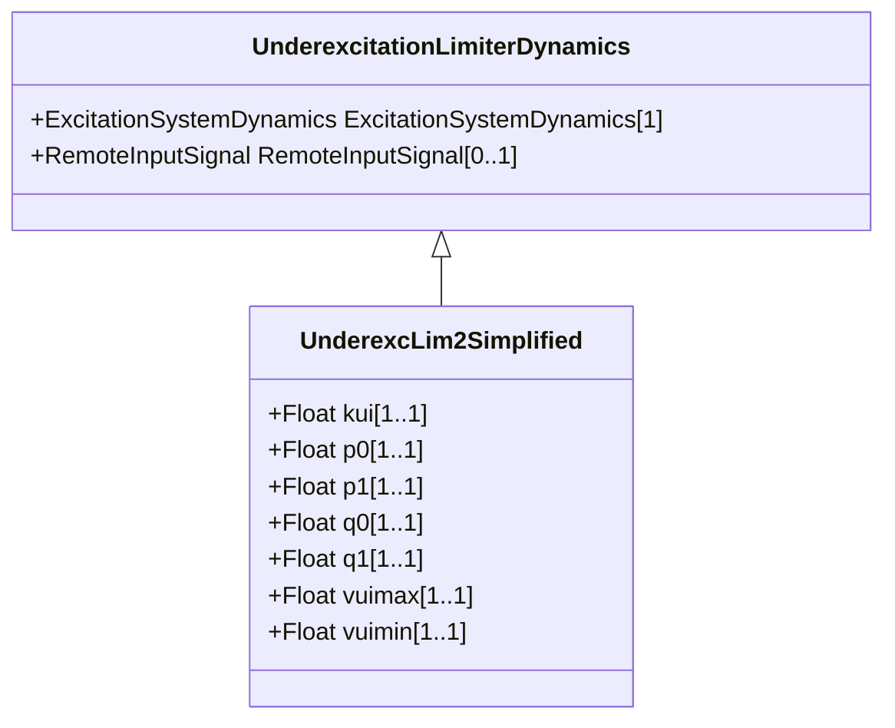

# UnderexcLim2Simplified

Simplified type UEL2 underexcitation limiter. This model can be derived from UnderexcLimIEEE2. The limit characteristic (look -up table) is a single straight-line, the same as UnderexcLimIEEE2 (see Figure 10.4 (p 32), IEEE 421.5-2005 Section 10.2).

## Inheritance

<button class="mermaid-enlarge-button">Enlarge Diagram</button>

## Attributes

| Label | Type | Multiplicity | Comment |
|-------|------|--------------|---------|
| kui | Float | 1..1 | Gain Under excitation limiter (KUI). Typical value = 0,1. |
| p0 | Float | 1..1 | Segment P initial point (P0). Typical value = 0. |
| p1 | Float | 1..1 | Segment P end point (P1). Typical value = 1. |
| q0 | Float | 1..1 | Segment Q initial point (Q0). Typical value = -0,31. |
| q1 | Float | 1..1 | Segment Q end point (Q1). Typical value = -0,1. |
| vuimax | Float | 1..1 | Maximum error signal (VUIMAX) (> UnderexcLim2Simplified.vuimin). Typical value = 1. |
| vuimin | Float | 1..1 | Minimum error signal (VUIMIN) (< UnderexcLim2Simplified.vuimax). Typical value = 0. |

