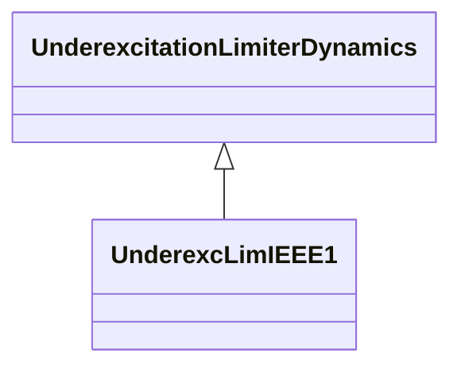

# UnderexcLimIEEE1

Type UEL1 model which has a circular limit boundary when plotted in terms of machine reactive power vs. real power output. Reference: IEEE UEL1 421.5-2005, 10.1.

## Inheritance

<button class="mermaid-enlarge-button">Enlarge Diagram</button>

## Attributes

| Label | Type | Multiplicity | Comment |
|-------|------|--------------|---------|
| kuc | Float | 1..1 | UEL centre setting (KUC). Typical value = 1,38. |
| kuf | Float | 1..1 | UEL excitation system stabilizer gain (KUF). Typical value = 3,3. |
| kui | Float | 1..1 | UEL integral gain (KUI). Typical value = 0. |
| kul | Float | 1..1 | UEL proportional gain (KUL). Typical value = 100. |
| kur | Float | 1..1 | UEL radius setting (KUR). Typical value = 1,95. |
| tu1 | Float | 1..1 | UEL lead time constant (TU1) (>= 0). Typical value = 0. |
| tu2 | Float | 1..1 | UEL lag time constant (TU2) (>= 0). Typical value = 0,05. |
| tu3 | Float | 1..1 | UEL lead time constant (TU3) (>= 0). Typical value = 0. |
| tu4 | Float | 1..1 | UEL lag time constant (TU4) (>= 0). Typical value = 0. |
| vucmax | Float | 1..1 | UEL maximum limit for operating point phasor magnitude (VUCMAX). Typical value = 5,8. |
| vuimax | Float | 1..1 | UEL integrator output maximum limit (VUIMAX) (> UnderexcLimIEEE1.vuimin). |
| vuimin | Float | 1..1 | UEL integrator output minimum limit (VUIMIN) (< UnderexcLimIEEE1.vuimax). |
| vulmax | Float | 1..1 | UEL output maximum limit (VULMAX) (> UnderexcLimIEEE1.vulmin). Typical value = 18. |
| vulmin | Float | 1..1 | UEL output minimum limit (VULMIN) (< UnderexcLimIEEE1.vulmax). Typical value = -18. |
| vurmax | Float | 1..1 | UEL maximum limit for radius phasor magnitude (VURMAX). Typical value = 5,8. |

