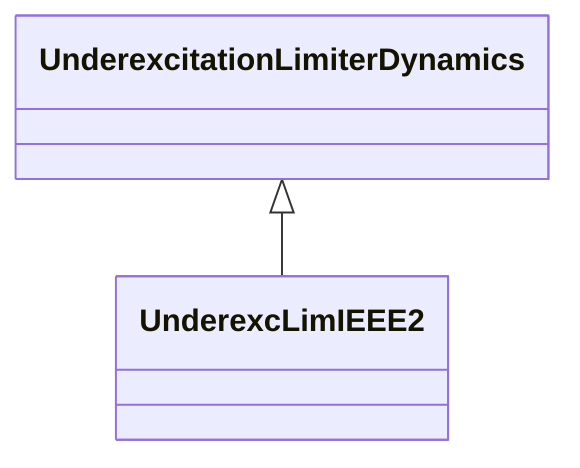

# UnderexcLimIEEE2

Type UEL2 underexcitation limiter which has either a straight-line or multi-segment characteristic when plotted in terms of machine reactive power output vs. real power output. Reference: IEEE UEL2 421.5-2005, 10.2 (limit characteristic lookup table shown in Figure 10.4 (p 32)).

## Inheritance

<button class="mermaid-enlarge-button">Enlarge Diagram</button>

## Attributes

| Label | Type | Multiplicity | Comment |
|-------|------|--------------|---------|
| k1 | Float | 1..1 | UEL terminal voltage exponent applied to real power input to UEL limit look-up table (k1). Typical value = 2. |
| k2 | Float | 1..1 | UEL terminal voltage exponent applied to reactive power output from UEL limit look-up table (k2). Typical value = 2. |
| kfb | Float | 1..1 | Gain associated with optional integrator feedback input signal to UEL (KFB). Typical value = 0. |
| kuf | Float | 1..1 | UEL excitation system stabilizer gain (KUF). Typical value = 0. |
| kui | Float | 1..1 | UEL integral gain (KUI). Typical value = 0,5. |
| kul | Float | 1..1 | UEL proportional gain (KUL). Typical value = 0,8. |
| p0 | Float | 1..1 | Real power values for endpoints (P0). Typical value = 0. |
| p1 | Float | 1..1 | Real power values for endpoints (P1). Typical value = 0,3. |
| p10 | Float | 1..1 | Real power values for endpoints (P10). |
| p2 | Float | 1..1 | Real power values for endpoints (P2). Typical value = 0,6. |
| p3 | Float | 1..1 | Real power values for endpoints (P3). Typical value = 0,9. |
| p4 | Float | 1..1 | Real power values for endpoints (P4). Typical value = 1,02. |
| p5 | Float | 1..1 | Real power values for endpoints (P5). |
| p6 | Float | 1..1 | Real power values for endpoints (P6). |
| p7 | Float | 1..1 | Real power values for endpoints (P7). |
| p8 | Float | 1..1 | Real power values for endpoints (P8). |
| p9 | Float | 1..1 | Real power values for endpoints (P9). |
| q0 | Float | 1..1 | Reactive power values for endpoints (Q0). Typical value = -0,31. |
| q1 | Float | 1..1 | Reactive power values for endpoints (Q1). Typical value = -0,31. |
| q10 | Float | 1..1 | Reactive power values for endpoints (Q10). |
| q2 | Float | 1..1 | Reactive power values for endpoints (Q2). Typical value = -0,28. |
| q3 | Float | 1..1 | Reactive power values for endpoints (Q3). Typical value = -0,21. |
| q4 | Float | 1..1 | Reactive power values for endpoints (Q4). Typical value = 0. |
| q5 | Float | 1..1 | Reactive power values for endpoints (Q5). |
| q6 | Float | 1..1 | Reactive power values for endpoints (Q6). |
| q7 | Float | 1..1 | Reactive power values for endpoints (Q7). |
| q8 | Float | 1..1 | Reactive power values for endpoints (Q8). |
| q9 | Float | 1..1 | Reactive power values for endpoints (Q9). |
| tu1 | Float | 1..1 | UEL lead time constant (TU1) (>= 0). Typical value = 0. |
| tu2 | Float | 1..1 | UEL lag time constant (TU2) (>= 0). Typical value = 0. |
| tu3 | Float | 1..1 | UEL lead time constant (TU3) (>= 0). Typical value = 0. |
| tu4 | Float | 1..1 | UEL lag time constant (TU4) (>= 0). Typical value = 0. |
| tul | Float | 1..1 | Time constant associated with optional integrator feedback input signal to UEL (TUL) (>= 0). Typical value = 0. |
| tup | Float | 1..1 | Real power filter time constant (TUP) (>= 0). Typical value = 5. |
| tuq | Float | 1..1 | Reactive power filter time constant (TUQ) (>= 0). Typical value = 0. |
| tuv | Float | 1..1 | Voltage filter time constant (TUV) (>= 0). Typical value = 5. |
| vuimax | Float | 1..1 | UEL integrator output maximum limit (VUIMAX) (> UnderexcLimIEEE2.vuimin). Typical value = 0,25. |
| vuimin | Float | 1..1 | UEL integrator output minimum limit (VUIMIN) (< UnderexcLimIEEE2.vuimax). Typical value = 0. |
| vulmax | Float | 1..1 | UEL output maximum limit (VULMAX) (> UnderexcLimIEEE2.vulmin). Typical value = 0,25. |
| vulmin | Float | 1..1 | UEL output minimum limit (VULMIN) (< UnderexcLimIEEE2.vulmax). Typical value = 0. |

