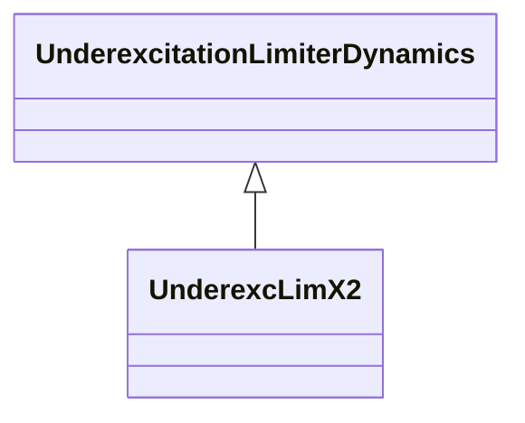

# UnderexcLimX2

Westinghouse minimum excitation limiter.

## Inheritance

<button class="mermaid-enlarge-button">Enlarge Diagram</button>

## Attributes

| Label | Type | Multiplicity | Comment |
|-------|------|--------------|---------|
| kf2 | Float | 1..1 | Differential gain (KF2). |
| km | Float | 1..1 | Minimum excitation limit gain (KM). |
| melmax | Float | 1..1 | Minimum excitation limit value (MELMAX). |
| qo | Float | 1..1 | Excitation centre setting (QO). |
| r | Float | 1..1 | Excitation radius (R). |
| tf2 | Float | 1..1 | Differential time constant (TF2) (>= 0). |
| tm | Float | 1..1 | Minimum excitation limit time constant (TM) (>= 0). |

