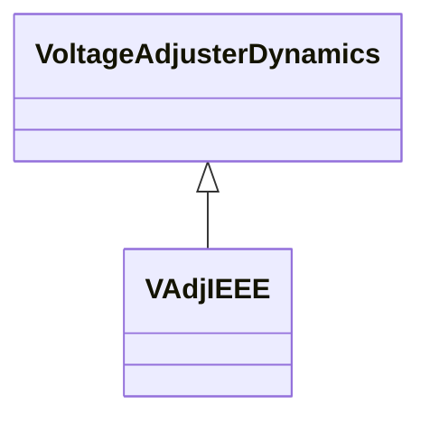

# VAdjIEEE

IEEE voltage adjuster which is used to represent the voltage adjuster in either a power factor or VAr control system. Reference: IEEE 421.5-2005, 11.1.

## Inheritance

<button class="mermaid-enlarge-button">Enlarge Diagram</button>

## Attributes

| Label | Type | Multiplicity | Comment |
|-------|------|--------------|---------|
| adjslew | Float | 1..1 | Rate at which output of adjuster changes (ADJ_SLEW). Unit = s / PU. Typical value = 300. |
| taoff | Float | 1..1 | Time that adjuster pulses are off (TAOFF) (>= 0). Typical value = 0,5. |
| taon | Float | 1..1 | Time that adjuster pulses are on (TAON) (>= 0). Typical value = 0,1. |
| vadjf | Float | 1..1 | Set high to provide a continuous raise or lower (VADJF). |
| vadjmax | Float | 1..1 | Maximum output of the adjuster (VADJMAX) (> VAdjIEEE.vadjmin). Typical value = 1,1. |
| vadjmin | Float | 1..1 | Minimum output of the adjuster (VADJMIN) (< VAdjIEEE.vadjmax). Typical value = 0,9. |

