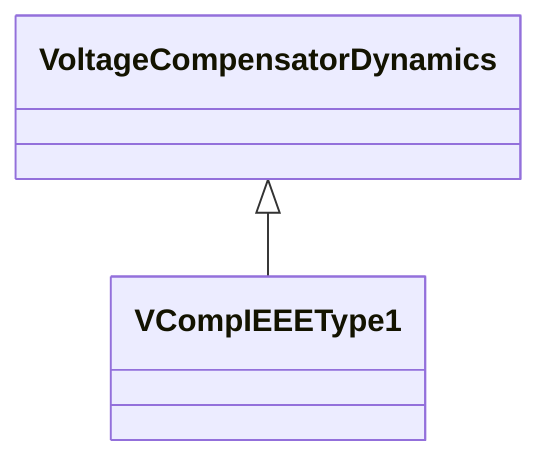

# VCompIEEEType1

Terminal voltage transducer and load compensator as defined in IEEE 421.5-2005, 4. This model is common to all excitation system models described in the IEEE Standard. Parameter details: If Rc and Xc are set to zero, the load compensation is not employed and the behaviour is as a simple sensing circuit. If all parameters (Rc, Xc and Tr) are set to zero, the standard model VCompIEEEType1 is bypassed. Reference: IEEE 421.5-2005 4.

## Inheritance

<button class="mermaid-enlarge-button">Enlarge Diagram</button>

## Attributes

| Label | Type | Multiplicity | Comment |
|-------|------|--------------|---------|
| rc | Float | 1..1 | Resistive component of compensation of a generator (Rc) (>= 0). |
| tr | Float | 1..1 | Time constant which is used for the combined voltage sensing and compensation signal (Tr) (>= 0). |
| xc | Float | 1..1 | Reactive component of compensation of a generator (Xc) (>= 0). |

