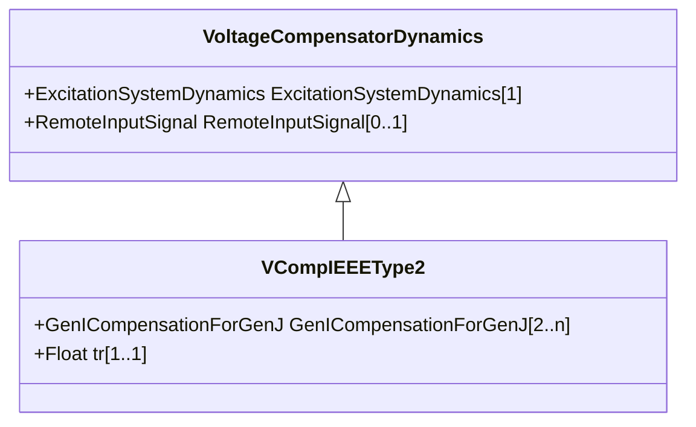

# VCompIEEEType2

Terminal voltage transducer and load compensator as defined in IEEE 421.5-2005, 4. This model is designed to cover the following types of compensation: reactive droop; transformer-drop or line-drop compensation; reactive differential compensation known also as cross-current compensation. Reference: IEEE 421.5-2005, 4.

## Inheritance

<button class="mermaid-enlarge-button">Enlarge Diagram</button>

## Attributes

| Label | Type | Multiplicity | Comment |
|-------|------|--------------|---------|
| GenICompensationForGenJ | [GenICompensationForGenJ](GenICompensationForGenJ.md) | 2..n | Compensation of this voltage compensator's generator for current flow out of another generator. |
| tr | Float | 1..1 | Time constant which is used for the combined voltage sensing and compensation signal (Tr) (>= 0). |

