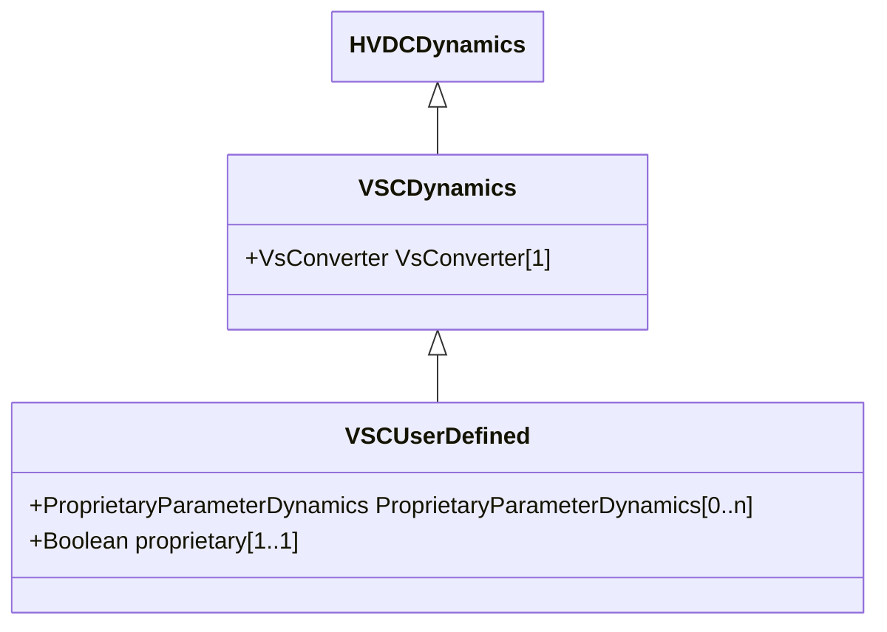

# VSCDynamics

VSC function block whose behaviour is described by reference to a standard model or by definition of a user-defined model.

## Inheritance

<button class="mermaid-enlarge-button">Enlarge Diagram</button>

## Attributes

| Label | Type | Multiplicity | Comment |
|-------|------|--------------|---------|
| VsConverter | [VsConverter](VsConverter.md) | 1 | Voltage source converter to which voltage source converter dynamics model applies. |

