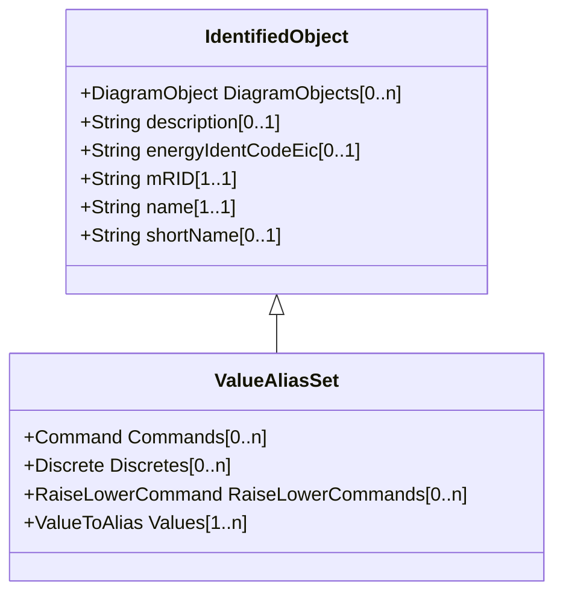

# ValueAliasSet

Describes the translation of a set of values into a name and is intendend to facilitate custom translations. Each ValueAliasSet has a name, description etc. A specific Measurement may represent a discrete state like Open, Closed, Intermediate etc. This requires a translation from the MeasurementValue.value number to a string, e.g. 0->'Invalid', 1->'Open', 2->'Closed', 3->'Intermediate'. Each ValueToAlias member in ValueAliasSet.Value describe a mapping for one particular value to a name.

## Inheritance

<button class="mermaid-enlarge-button">Enlarge Diagram</button>

## Attributes

| Label | Type | Multiplicity | Comment |
|-------|------|--------------|---------|
| Commands | [Command](Command.md) | 0..n | The Commands using the set for translation. |
| Discretes | [Discrete](Discrete.md) | 0..n | The Measurements using the set for translation. |
| RaiseLowerCommands | [RaiseLowerCommand](RaiseLowerCommand.md) | 0..n | The Commands using the set for translation. |
| Values | [ValueToAlias](ValueToAlias.md) | 1..n | The ValueToAlias mappings included in the set. |

