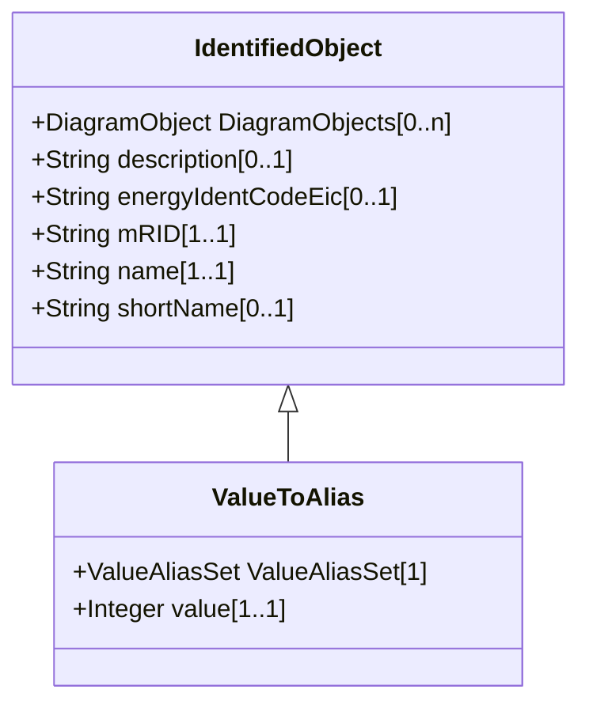

# ValueToAlias

Describes the translation of one particular value into a name, e.g. 1 as 'Open'.

## Inheritance

<button class="mermaid-enlarge-button">Enlarge Diagram</button>

## Attributes

| Label | Type | Multiplicity | Comment |
|-------|------|--------------|---------|
| ValueAliasSet | [ValueAliasSet](ValueAliasSet.md) | 1 | The ValueAliasSet having the ValueToAlias mappings. |
| value | Integer | 1..1 | The value that is mapped. |

