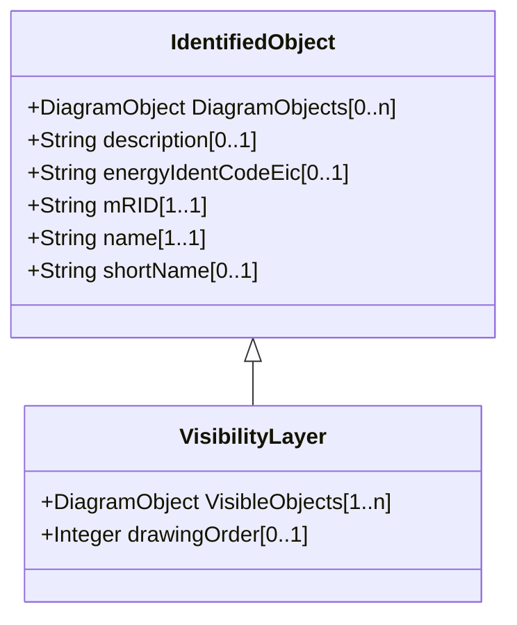

# VisibilityLayer

Layers are typically used for grouping diagram objects according to themes and scales. Themes are used to display or hide certain information (e.g., lakes, borders), while scales are used for hiding or displaying information depending on the current zoom level (hide text when it is too small to be read, or when it exceeds the screen size). This is also called de-cluttering. CIM based graphics exchange supports an m:n relationship between diagram objects and layers. The importing system shall convert an m:n case into an appropriate 1:n representation if the importing system does not support m:n.

## Inheritance

<button class="mermaid-enlarge-button">Enlarge Diagram</button>

## Attributes

| Label | Type | Multiplicity | Comment |
|-------|------|--------------|---------|
| VisibleObjects | [DiagramObject](DiagramObject.md) | 1..n | A visibility layer can contain one or more diagram objects. |
| drawingOrder | Integer | 0..1 | The drawing order for this layer. The higher the number, the later the layer and the objects within it are rendered. |

