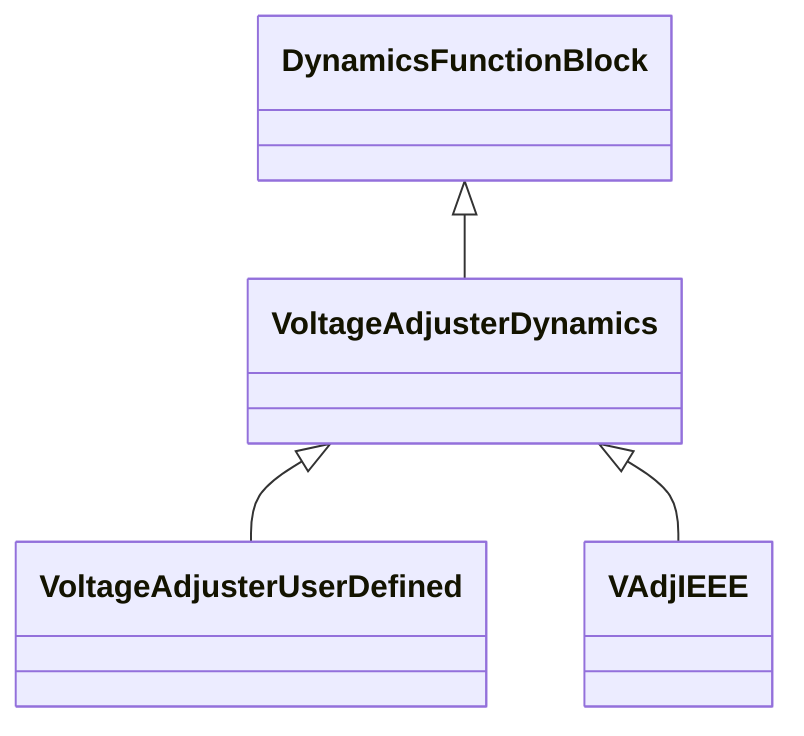

# VoltageAdjusterDynamics

Voltage adjuster function block whose behaviour is described by reference to a standard model or by definition of a user-defined model.

## Inheritance

<button class="mermaid-enlarge-button">Enlarge Diagram</button>

## Attributes

| Label | Type | Multiplicity | Comment |
|-------|------|--------------|---------|
| PFVArControllerType1Dynamics | [PFVArControllerType1Dynamics](PFVArControllerType1Dynamics.md) | 1 | Power factor or VAr controller type 1 model with which this voltage adjuster is associated. |

