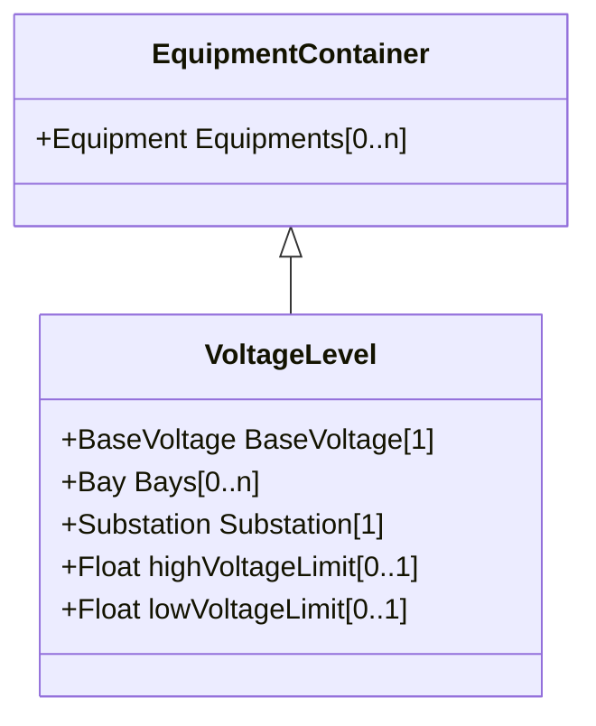

# VoltageLevel

A collection of equipment at one common system voltage forming a switchgear. The equipment typically consists of breakers, busbars, instrumentation, control, regulation and protection devices as well as assemblies of all these.

## Inheritance

<button class="mermaid-enlarge-button">Enlarge Diagram</button>

## Attributes

| Label | Type | Multiplicity | Comment |
|-------|------|--------------|---------|
| BaseVoltage | [BaseVoltage](BaseVoltage.md) | 1 | The base voltage used for all equipment within the voltage level. |
| Bays | [Bay](Bay.md) | 0..n | The bays within this voltage level. |
| Substation | [Substation](Substation.md) | 1 | The substation of the voltage level. |
| highVoltageLimit | Float | 0..1 | The bus bar's high voltage limit. The limit applies to all equipment and nodes contained in a given VoltageLevel. It is not required that it is exchanged in pair with lowVoltageLimit. It is preferable to use operational VoltageLimit, which prevails, if present. |
| lowVoltageLimit | Float | 0..1 | The bus bar's low voltage limit. The limit applies to all equipment and nodes contained in a given VoltageLevel. It is not required that it is exchanged in pair with highVoltageLimit. It is preferable to use operational VoltageLimit, which prevails, if present. |

