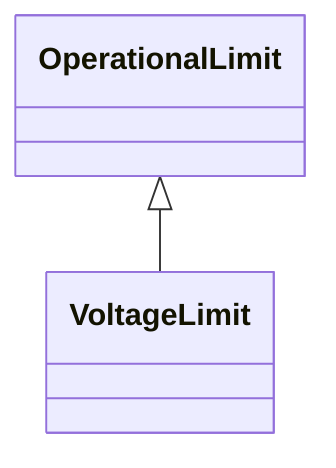

# VoltageLimit

Operational limit applied to voltage. The use of operational VoltageLimit is preferred instead of limits defined at VoltageLevel. The operational VoltageLimits are used, if present.

## Inheritance

<button class="mermaid-enlarge-button">Enlarge Diagram</button>

## Attributes

| Label | Type | Multiplicity | Comment |
|-------|------|--------------|---------|
| normalValue | Float | 1..1 | The normal limit on voltage. High or low limit nature of the limit depends upon the properties of the operational limit type. The attribute shall be a positive value or zero. |
| value | Float | 1..1 | Limit on voltage. High or low limit nature of the limit depends upon the properties of the operational limit type. The attribute shall be a positive value or zero. |

