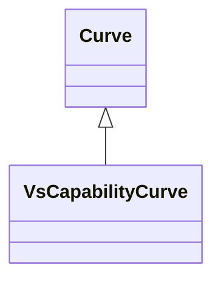

# VsCapabilityCurve

The P-Q capability curve for a voltage source converter, with P on X-axis and Qmin and Qmax on Y1-axis and Y2-axis.

## Inheritance

<button class="mermaid-enlarge-button">Enlarge Diagram</button>

## Attributes

| Label | Type | Multiplicity | Comment |
|-------|------|--------------|---------|
| VsConverterDCSides | [VsConverter](VsConverter.md) | 0..n | All converters with this capability curve. |

