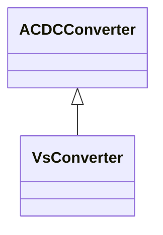

# VsConverter

DC side of the voltage source converter (VSC).

## Inheritance

<button class="mermaid-enlarge-button">Enlarge Diagram</button>

## Attributes

| Label | Type | Multiplicity | Comment |
|-------|------|--------------|---------|
| CapabilityCurve | [VsCapabilityCurve](VsCapabilityCurve.md) | 0..1 | Capability curve of this converter. |
| VSCDynamics | [VSCDynamics](VSCDynamics.md) | 0..1 | Voltage source converter dynamics model used to describe dynamic behaviour of this converter. |
| delta | Float | 1..1 | Angle between VsConverter.uv and ACDCConverter.uc. It is converter’s state variable used in power flow. The attribute shall be a positive value or zero. |
| droop | Float | 0..1 | Droop constant. The pu value is obtained as D [kV/MW] x Sb / Ubdc. The attribute shall be a positive value. |
| droopCompensation | Float | 0..1 | Compensation constant. Used to compensate for voltage drop when controlling voltage at a distant bus. The attribute shall be a positive value. |
| maxModulationIndex | Float | 0..1 | The maximum quotient between the AC converter voltage (Uc) and DC voltage (Ud). A factor typically less than 1. It is converter’s configuration data used in power flow. |
| pPccControl | [VsPpccControlKind](VsPpccControlKind.md) | 1..1 | Kind of control of real power and/or DC voltage. |
| qPccControl | [VsQpccControlKind](VsQpccControlKind.md) | 1..1 | Kind of reactive power control. |
| qShare | Float | 0..1 | Reactive power sharing factor among parallel converters on Uac control. The attribute shall be a positive value or zero. |
| targetPWMfactor | Float | 0..1 | Magnitude of pulse-modulation factor. The attribute shall be a positive value. |
| targetPhasePcc | Float | 0..1 | Phase target at AC side, at point of common coupling. The attribute shall be a positive value. |
| targetPowerFactorPcc | Float | 0..1 | Power factor target at the AC side, at point of common coupling. The attribute shall be a positive value. |
| targetQpcc | Float | 0..1 | Reactive power injection target in AC grid, at point of common coupling. Load sign convention is used, i.e. positive sign means flow out from a node. |
| targetUpcc | Float | 0..1 | Voltage target in AC grid, at point of common coupling. The attribute shall be a positive value. |
| uv | Float | 1..1 | Line-to-line voltage on the valve side of the converter transformer. It is converter’s state variable, result from power flow. The attribute shall be a positive value. |

