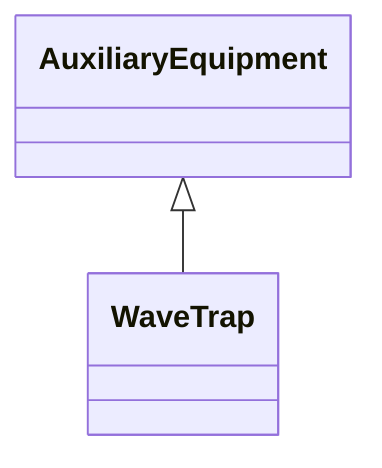

# WaveTrap

Line traps are devices that impede high frequency power line carrier signals yet present a negligible impedance at the main power frequency.

## Inheritance

<button class="mermaid-enlarge-button">Enlarge Diagram</button>

## Attributes

| Label | Type | Multiplicity | Comment |
|-------|------|--------------|---------|
| No attributes | | | |

