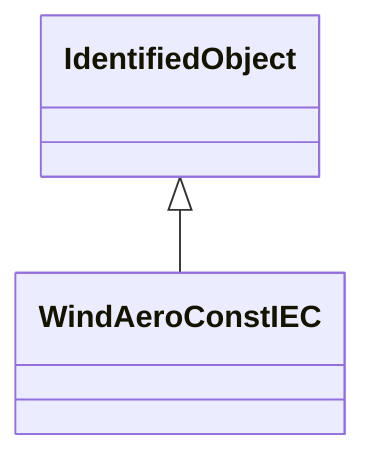

# WindAeroConstIEC

Constant aerodynamic torque model which assumes that the aerodynamic torque is constant. Reference: IEC 61400-27-1:2015, 5.6.1.1.

## Inheritance

<button class="mermaid-enlarge-button">Enlarge Diagram</button>

## Attributes

| Label | Type | Multiplicity | Comment |
|-------|------|--------------|---------|
| WindGenTurbineType1aIEC | [WindGenTurbineType1aIEC](WindGenTurbineType1aIEC.md) | 1 | Wind turbine type 1A model with which this wind aerodynamic model is associated. |

