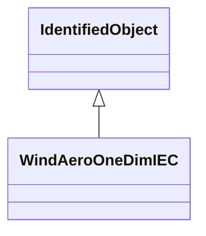

# WindAeroOneDimIEC

One-dimensional aerodynamic model. Reference: IEC 61400-27-1:2015, 5.6.1.2.

## Inheritance

<button class="mermaid-enlarge-button">Enlarge Diagram</button>

## Attributes

| Label | Type | Multiplicity | Comment |
|-------|------|--------------|---------|
| WindTurbineType3IEC | [WindTurbineType3IEC](WindTurbineType3IEC.md) | 1 | Wind turbine type 3 model with which this wind aerodynamic model is associated. |
| ka | Float | 1..1 | Aerodynamic gain (ka). It is a type-dependent parameter. |
| thetaomega | Float | 1..1 | Initial pitch angle (thetaomega0). It is a case-dependent parameter. |

