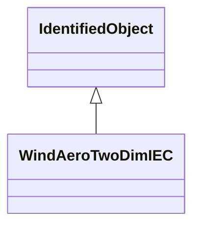

# WindAeroTwoDimIEC

Two-dimensional aerodynamic model. Reference: IEC 61400-27-1:2015, 5.6.1.3.

## Inheritance

<button class="mermaid-enlarge-button">Enlarge Diagram</button>

## Attributes

| Label | Type | Multiplicity | Comment |
|-------|------|--------------|---------|
| WindTurbineType3IEC | [WindTurbineType3IEC](WindTurbineType3IEC.md) | 1 | Wind turbine type 3 model with which this wind aerodynamic model is associated. |
| dpomega | Float | 1..1 | Partial derivative of aerodynamic power with respect to changes in WTR speed (dpomega). It is a type-dependent parameter. |
| dptheta | Float | 1..1 | Partial derivative of aerodynamic power with respect to changes in pitch angle (dptheta). It is a type-dependent parameter. |
| dpv1 | Float | 1..1 | Partial derivative (dpv1). It is a type-dependent parameter. |
| omegazero | Float | 1..1 | Rotor speed if the wind turbine is not derated (omega0). It is a type-dependent parameter. |
| pavail | Float | 1..1 | Available aerodynamic power (pavail). It is a case-dependent parameter. |
| thetav2 | Float | 1..1 | Blade angle at twice rated wind speed (thetav2). It is a type-dependent parameter. |
| thetazero | Float | 1..1 | Pitch angle if the wind turbine is not derated (theta0). It is a case-dependent parameter. |

