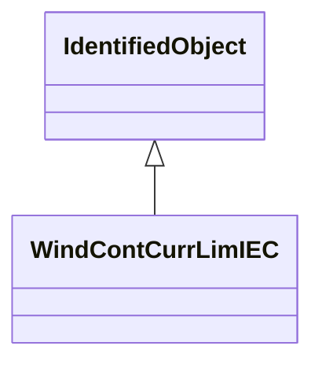

# WindContCurrLimIEC

Current limitation model. The current limitation model combines the physical limits and the control limits. Reference: IEC 61400-27-1:2015, 5.6.5.8.

## Inheritance

<button class="mermaid-enlarge-button">Enlarge Diagram</button>

## Attributes

| Label | Type | Multiplicity | Comment |
|-------|------|--------------|---------|
| WindDynamicsLookupTable | [WindDynamicsLookupTable](WindDynamicsLookupTable.md) | 1..n | The wind dynamics lookup table associated with this current control limitation model. |
| WindTurbineType3or4IEC | [WindTurbineType3or4IEC](WindTurbineType3or4IEC.md) | 1 | Wind turbine type 3 or type 4 model with which this wind control current limitation model is associated. |
| imax | Float | 1..1 | Maximum continuous current at the wind turbine terminals (imax). It is a type-dependent parameter. |
| imaxdip | Float | 1..1 | Maximum current during voltage dip at the wind turbine terminals (imaxdip). It is a project-dependent parameter. |
| kpqu | Float | 1..1 | Partial derivative of reactive current limit (Kpqu) versus voltage. It is a type-dependent parameter. |
| mdfslim | Boolean | 1..1 | Limitation of type 3 stator current (MDFSLim). MDFSLim = 1 for wind turbines type 4. It is a type-dependent parameter. false= total current limitation (0 in the IEC model) true=stator current limitation (1 in the IEC model). |
| mqpri | Boolean | 1..1 | Prioritisation of Q control during UVRT (Mqpri). It is a project-dependent parameter. true = reactive power priority (1 in the IEC model) false = active power priority (0 in the IEC model). |
| tufiltcl | Float | 1..1 | Voltage measurement filter time constant (Tufiltcl) (>= 0). It is a type-dependent parameter. |
| upqumax | Float | 1..1 | Wind turbine voltage in the operation point where zero reactive current can be delivered (upqumax). It is a type-dependent parameter. |

