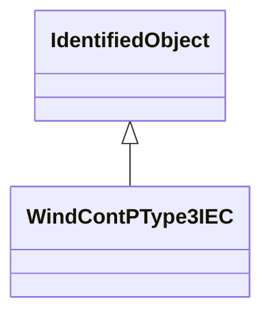

# WindContPType3IEC

P control model type 3. Reference: IEC 61400-27-1:2015, 5.6.5.4.

## Inheritance

<button class="mermaid-enlarge-button">Enlarge Diagram</button>

## Attributes

| Label | Type | Multiplicity | Comment |
|-------|------|--------------|---------|
| WindDynamicsLookupTable | [WindDynamicsLookupTable](WindDynamicsLookupTable.md) | 1..n | The wind dynamics lookup table associated with this P control type 3 model. |
| WindTurbineType3IEC | [WindTurbineType3IEC](WindTurbineType3IEC.md) | 1 | Wind turbine type 3 model with which this wind control P type 3 model is associated. |
| dpmax | Float | 1..1 | Maximum wind turbine power ramp rate (dpmax). It is a type-dependent parameter. |
| dprefmax | Float | 1..1 | Maximum ramp rate of wind turbine reference power (dprefmax). It is a project-dependent parameter. |
| dprefmin | Float | 1..1 | Minimum ramp rate of wind turbine reference power (dprefmin). It is a project-dependent parameter. |
| dthetamax | Float | 1..1 | Ramp limitation of torque, required in some grid codes (dtmax). It is a project-dependent parameter. |
| dthetamaxuvrt | Float | 1..1 | Limitation of torque rise rate during UVRT (dthetamaxUVRT). It is a project-dependent parameter. |
| kdtd | Float | 1..1 | Gain for active drive train damping (KDTD). It is a type-dependent parameter. |
| kip | Float | 1..1 | PI controller integration parameter (KIp). It is a type-dependent parameter. |
| kpp | Float | 1..1 | PI controller proportional gain (KPp). It is a type-dependent parameter. |
| mpuvrt | Boolean | 1..1 | Enable UVRT power control mode (MpUVRT). It is a project-dependent parameter. true = voltage control (1 in the IEC model) false = reactive power control (0 in the IEC model). |
| omegadtd | Float | 1..1 | Active drive train damping frequency (omegaDTD). It can be calculated from two mass model parameters. It is a type-dependent parameter. |
| omegaoffset | Float | 1..1 | Offset to reference value that limits controller action during rotor speed changes (omegaoffset). It is a case-dependent parameter. |
| pdtdmax | Float | 1..1 | Maximum active drive train damping power (pDTDmax). It is a type-dependent parameter. |
| tdvs | Float | 1..1 | Time delay after deep voltage sags (TDVS) (>= 0). It is a project-dependent parameter. |
| thetaemin | Float | 1..1 | Minimum electrical generator torque (temin). It is a type-dependent parameter. |
| thetauscale | Float | 1..1 | Voltage scaling factor of reset-torque (tuscale). It is a project-dependent parameter. |
| tomegafiltp3 | Float | 1..1 | Filter time constant for generator speed measurement (Tomegafiltp3) (>= 0). It is a type-dependent parameter. |
| tomegaref | Float | 1..1 | Time constant in speed reference filter (Tomega,ref) (>= 0). It is a type-dependent parameter. |
| tpfiltp3 | Float | 1..1 | Filter time constant for power measurement (Tpfiltp3) (>= 0). It is a type-dependent parameter. |
| tpord | Float | 1..1 | Time constant in power order lag (Tpord). It is a type-dependent parameter. |
| tufiltp3 | Float | 1..1 | Filter time constant for voltage measurement (Tufiltp3) (>= 0). It is a type-dependent parameter. |
| udvs | Float | 1..1 | Voltage limit for hold UVRT status after deep voltage sags (uDVS). It is a project-dependent parameter. |
| updip | Float | 1..1 | Voltage dip threshold for P-control (uPdip). Part of turbine control, often different (e.g 0.8) from converter thresholds. It is a project-dependent parameter. |
| zeta | Float | 1..1 | Coefficient for active drive train damping (zeta). It is a type-dependent parameter. |

