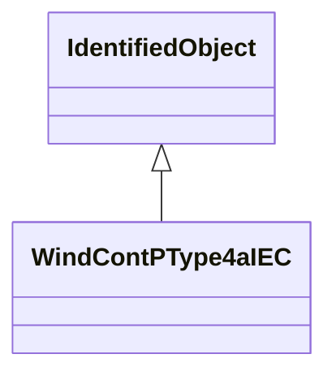

# WindContPType4aIEC

P control model type 4A. Reference: IEC 61400-27-1:2015, 5.6.5.5.

## Inheritance

<button class="mermaid-enlarge-button">Enlarge Diagram</button>

## Attributes

| Label | Type | Multiplicity | Comment |
|-------|------|--------------|---------|
| WindTurbineType4aIEC | [WindTurbineType4aIEC](WindTurbineType4aIEC.md) | 1 | Wind turbine type 4A model with which this wind control P type 4A model is associated. |
| dpmaxp4a | Float | 1..1 | Maximum wind turbine power ramp rate (dpmaxp4A). It is a project-dependent parameter. |
| tpordp4a | Float | 1..1 | Time constant in power order lag (Tpordp4A) (>= 0). It is a type-dependent parameter. |
| tufiltp4a | Float | 1..1 | Voltage measurement filter time constant (Tufiltp4A) (>= 0). It is a type-dependent parameter. |

