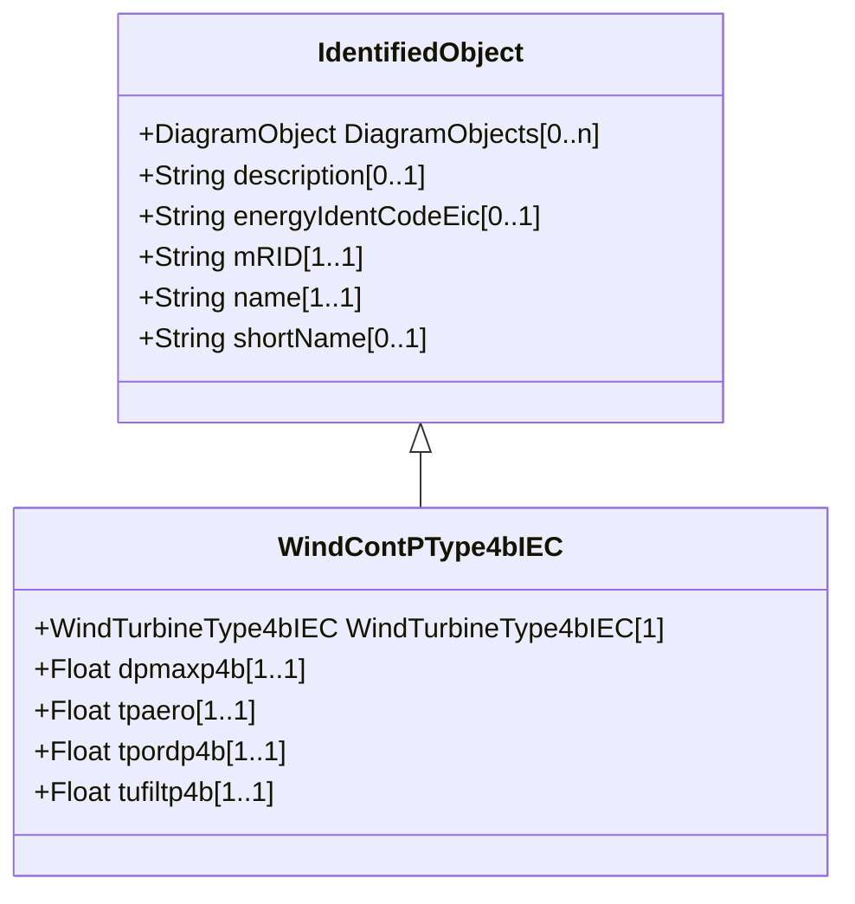

# WindContPType4bIEC

P control model type 4B. Reference: IEC 61400-27-1:2015, 5.6.5.6.

## Inheritance

<button class="mermaid-enlarge-button">Enlarge Diagram</button>

## Attributes

| Label | Type | Multiplicity | Comment |
|-------|------|--------------|---------|
| WindTurbineType4bIEC | [WindTurbineType4bIEC](WindTurbineType4bIEC.md) | 1 | Wind turbine type 4B model with which this wind control P type 4B model is associated. |
| dpmaxp4b | Float | 1..1 | Maximum wind turbine power ramp rate (dpmaxp4B). It is a project-dependent parameter. |
| tpaero | Float | 1..1 | Time constant in aerodynamic power response (Tpaero) (>= 0). It is a type-dependent parameter. |
| tpordp4b | Float | 1..1 | Time constant in power order lag (Tpordp4B) (>= 0). It is a type-dependent parameter. |
| tufiltp4b | Float | 1..1 | Voltage measurement filter time constant (Tufiltp4B) (>= 0). It is a type-dependent parameter. |

