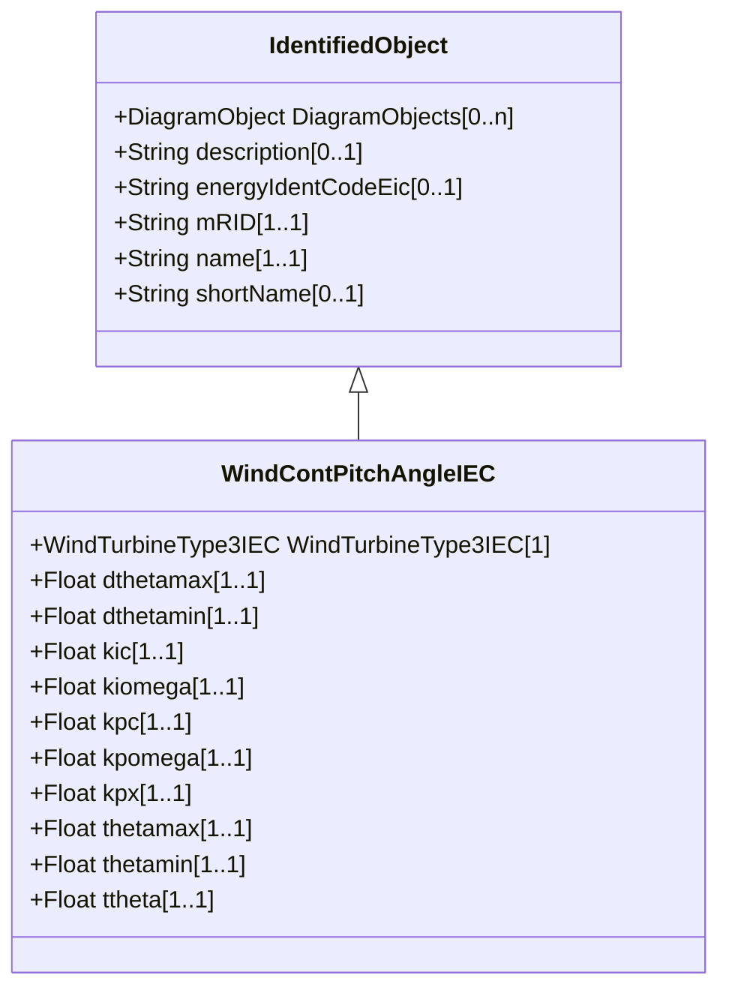

# WindContPitchAngleIEC

Pitch angle control model. Reference: IEC 61400-27-1:2015, 5.6.5.2.

## Inheritance

<button class="mermaid-enlarge-button">Enlarge Diagram</button>

## Attributes

| Label | Type | Multiplicity | Comment |
|-------|------|--------------|---------|
| WindTurbineType3IEC | [WindTurbineType3IEC](WindTurbineType3IEC.md) | 1 | Wind turbine type 3 model with which this pitch control model is associated. |
| dthetamax | Float | 1..1 | Maximum pitch positive ramp rate (dthetamax) (> WindContPitchAngleIEC.dthetamin). It is a type-dependent parameter. Unit = degrees / s. |
| dthetamin | Float | 1..1 | Maximum pitch negative ramp rate (dthetamin) (< WindContPitchAngleIEC.dthetamax). It is a type-dependent parameter. Unit = degrees / s. |
| kic | Float | 1..1 | Power PI controller integration gain (KIc). It is a type-dependent parameter. |
| kiomega | Float | 1..1 | Speed PI controller integration gain (KIomega). It is a type-dependent parameter. |
| kpc | Float | 1..1 | Power PI controller proportional gain (KPc). It is a type-dependent parameter. |
| kpomega | Float | 1..1 | Speed PI controller proportional gain (KPomega). It is a type-dependent parameter. |
| kpx | Float | 1..1 | Pitch cross coupling gain (KPX). It is a type-dependent parameter. |
| thetamax | Float | 1..1 | Maximum pitch angle (thetamax) (> WindContPitchAngleIEC.thetamin). It is a type-dependent parameter. |
| thetamin | Float | 1..1 | Minimum pitch angle (thetamin) (< WindContPitchAngleIEC.thetamax). It is a type-dependent parameter. |
| ttheta | Float | 1..1 | Pitch time constant (ttheta) (>= 0). It is a type-dependent parameter. |

