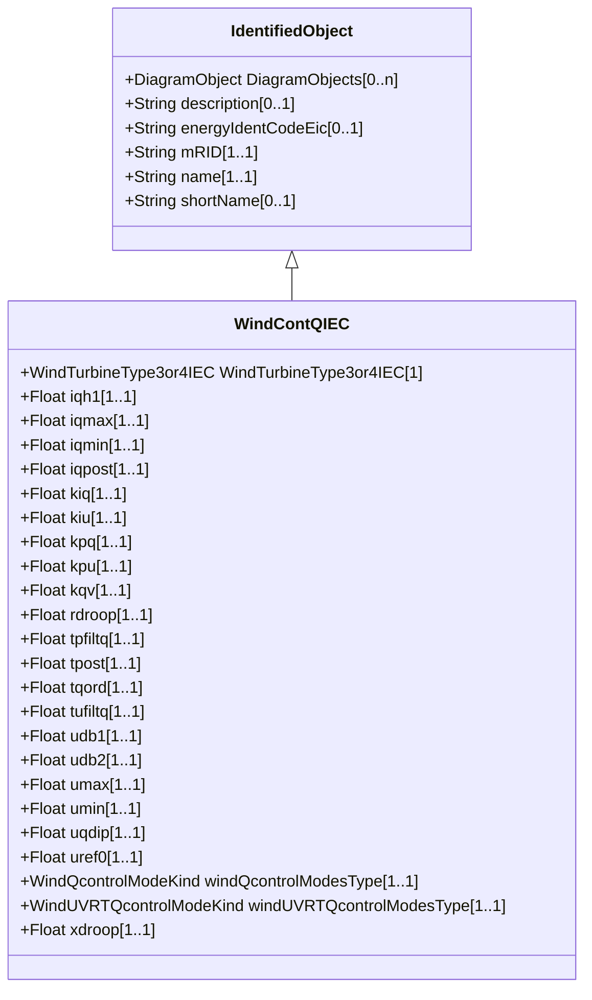

# WindContQIEC

Q control model. Reference: IEC 61400-27-1:2015, 5.6.5.7.

## Inheritance

<button class="mermaid-enlarge-button">Enlarge Diagram</button>

## Attributes

| Label | Type | Multiplicity | Comment |
|-------|------|--------------|---------|
| WindTurbineType3or4IEC | [WindTurbineType3or4IEC](WindTurbineType3or4IEC.md) | 1 | Wind turbine type 3 or type 4 model with which this reactive control model is associated. |
| iqh1 | Float | 1..1 | Maximum reactive current injection during dip (iqh1). It is a type-dependent parameter. |
| iqmax | Float | 1..1 | Maximum reactive current injection (iqmax) (> WindContQIEC.iqmin). It is a type-dependent parameter. |
| iqmin | Float | 1..1 | Minimum reactive current injection (iqmin) (< WindContQIEC.iqmax). It is a type-dependent parameter. |
| iqpost | Float | 1..1 | Post fault reactive current injection (iqpost). It is a project-dependent parameter. |
| kiq | Float | 1..1 | Reactive power PI controller integration gain (KI,q). It is a type-dependent parameter. |
| kiu | Float | 1..1 | Voltage PI controller integration gain (KI,u). It is a type-dependent parameter. |
| kpq | Float | 1..1 | Reactive power PI controller proportional gain (KP,q). It is a type-dependent parameter. |
| kpu | Float | 1..1 | Voltage PI controller proportional gain (KP,u). It is a type-dependent parameter. |
| kqv | Float | 1..1 | Voltage scaling factor for UVRT current (Kqv). It is a project-dependent parameter. |
| rdroop | Float | 1..1 | Resistive component of voltage drop impedance (rdroop) (>= 0). It is a project-dependent parameter. |
| tpfiltq | Float | 1..1 | Power measurement filter time constant (Tpfiltq) (>= 0). It is a type-dependent parameter. |
| tpost | Float | 1..1 | Length of time period where post fault reactive power is injected (Tpost) (>= 0). It is a project-dependent parameter. |
| tqord | Float | 1..1 | Time constant in reactive power order lag (Tqord) (>= 0). It is a type-dependent parameter. |
| tufiltq | Float | 1..1 | Voltage measurement filter time constant (Tufiltq) (>= 0). It is a type-dependent parameter. |
| udb1 | Float | 1..1 | Voltage deadband lower limit (udb1). It is a type-dependent parameter. |
| udb2 | Float | 1..1 | Voltage deadband upper limit (udb2). It is a type-dependent parameter. |
| umax | Float | 1..1 | Maximum voltage in voltage PI controller integral term (umax) (> WindContQIEC.umin). It is a type-dependent parameter. |
| umin | Float | 1..1 | Minimum voltage in voltage PI controller integral term (umin) (< WindContQIEC.umax). It is a type-dependent parameter. |
| uqdip | Float | 1..1 | Voltage threshold for UVRT detection in Q control (uqdip). It is a type-dependent parameter. |
| uref0 | Float | 1..1 | User-defined bias in voltage reference (uref0). It is a case-dependent parameter. |
| windQcontrolModesType | [WindQcontrolModeKind](WindQcontrolModeKind.md) | 1..1 | Types of general wind turbine Q control modes (MqG). It is a project-dependent parameter. |
| windUVRTQcontrolModesType | [WindUVRTQcontrolModeKind](WindUVRTQcontrolModeKind.md) | 1..1 | Types of UVRT Q control modes (MqUVRT). It is a project-dependent parameter. |
| xdroop | Float | 1..1 | Inductive component of voltage drop impedance (xdroop) (>= 0). It is a project-dependent parameter. |

