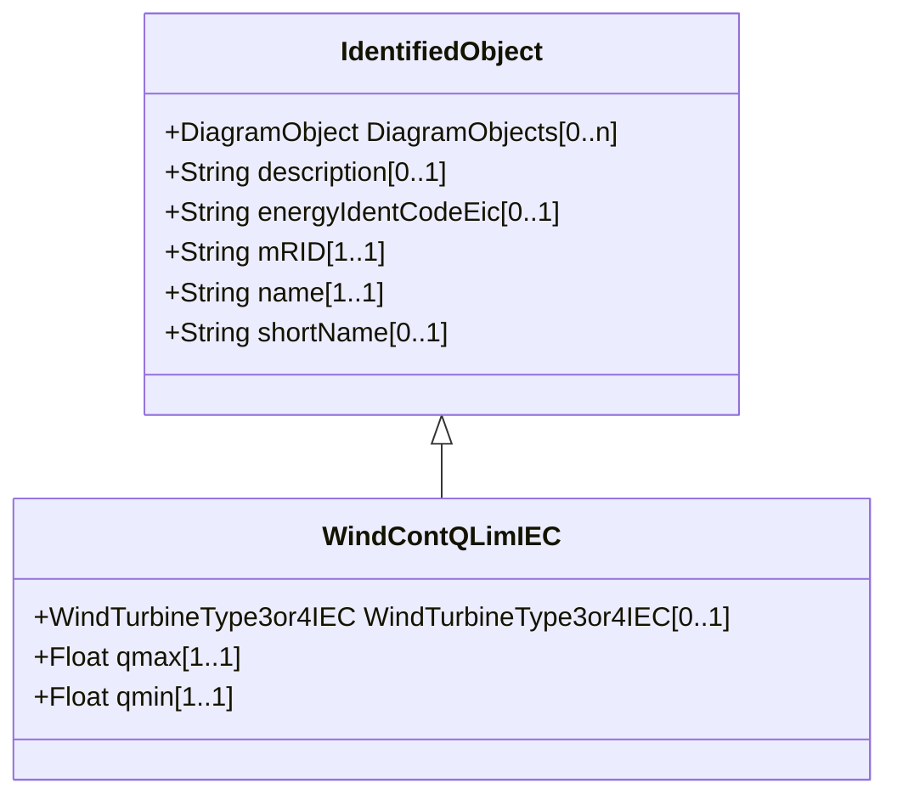

# WindContQLimIEC

Constant Q limitation model. Reference: IEC 61400-27-1:2015, 5.6.5.9.

## Inheritance

<button class="mermaid-enlarge-button">Enlarge Diagram</button>

## Attributes

| Label | Type | Multiplicity | Comment |
|-------|------|--------------|---------|
| WindTurbineType3or4IEC | [WindTurbineType3or4IEC](WindTurbineType3or4IEC.md) | 0..1 | Wind generator type 3 or type 4 model with which this constant Q limitation model is associated. |
| qmax | Float | 1..1 | Maximum reactive power (qmax) (> WindContQLimIEC.qmin). It is a type-dependent parameter. |
| qmin | Float | 1..1 | Minimum reactive power (qmin) (< WindContQLimIEC.qmax). It is a type-dependent parameter. |

