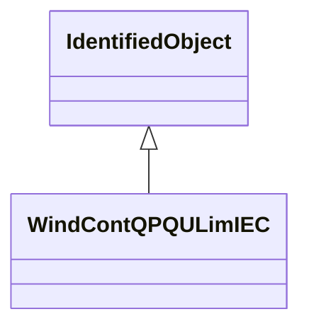

# WindContQPQULimIEC

QP and QU limitation model. Reference: IEC 61400-27-1:2015, 5.6.5.10.

## Inheritance

<button class="mermaid-enlarge-button">Enlarge Diagram</button>

## Attributes

| Label | Type | Multiplicity | Comment |
|-------|------|--------------|---------|
| WindDynamicsLookupTable | [WindDynamicsLookupTable](WindDynamicsLookupTable.md) | 1..n | The wind dynamics lookup table associated with this QP and QU limitation model. |
| WindTurbineType3or4IEC | [WindTurbineType3or4IEC](WindTurbineType3or4IEC.md) | 0..1 | Wind generator type 3 or type 4 model with which this QP and QU limitation model is associated. |
| tpfiltql | Float | 1..1 | Power measurement filter time constant for Q capacity (Tpfiltql) (>= 0). It is a type-dependent parameter. |
| tufiltql | Float | 1..1 | Voltage measurement filter time constant for Q capacity (Tufiltql) (>= 0). It is a type-dependent parameter. |

