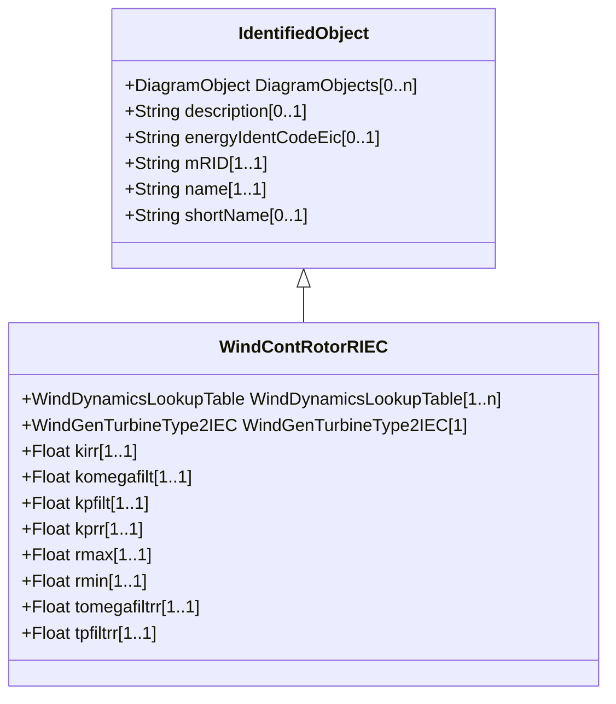

# WindContRotorRIEC

Rotor resistance control model. Reference: IEC 61400-27-1:2015, 5.6.5.3.

## Inheritance

<button class="mermaid-enlarge-button">Enlarge Diagram</button>

## Attributes

| Label | Type | Multiplicity | Comment |
|-------|------|--------------|---------|
| WindDynamicsLookupTable | [WindDynamicsLookupTable](WindDynamicsLookupTable.md) | 1..n | The wind dynamics lookup table associated with this rotor resistance control model. |
| WindGenTurbineType2IEC | [WindGenTurbineType2IEC](WindGenTurbineType2IEC.md) | 1 | Wind turbine type 2 model with whitch this wind control rotor resistance model is associated. |
| kirr | Float | 1..1 | Integral gain in rotor resistance PI controller (KIrr). It is a type-dependent parameter. |
| komegafilt | Float | 1..1 | Filter gain for generator speed measurement (Komegafilt). It is a type-dependent parameter. |
| kpfilt | Float | 1..1 | Filter gain for power measurement (Kpfilt). It is a type-dependent parameter. |
| kprr | Float | 1..1 | Proportional gain in rotor resistance PI controller (KPrr). It is a type-dependent parameter. |
| rmax | Float | 1..1 | Maximum rotor resistance (rmax) (> WindContRotorRIEC.rmin). It is a type-dependent parameter. |
| rmin | Float | 1..1 | Minimum rotor resistance (rmin) (< WindContRotorRIEC.rmax). It is a type-dependent parameter. |
| tomegafiltrr | Float | 1..1 | Filter time constant for generator speed measurement (Tomegafiltrr) (>= 0). It is a type-dependent parameter. |
| tpfiltrr | Float | 1..1 | Filter time constant for power measurement (Tpfiltrr) (>= 0). It is a type-dependent parameter. |

