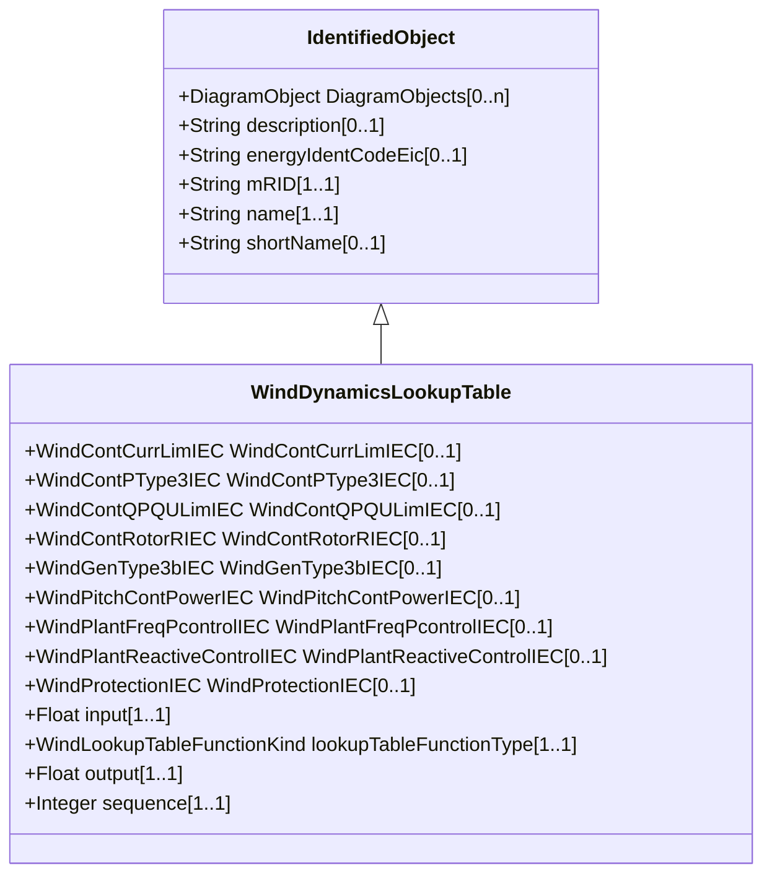

# WindDynamicsLookupTable

Look up table for the purpose of wind standard models.

## Inheritance

<button class="mermaid-enlarge-button">Enlarge Diagram</button>

## Attributes

| Label | Type | Multiplicity | Comment |
|-------|------|--------------|---------|
| WindContCurrLimIEC | [WindContCurrLimIEC](WindContCurrLimIEC.md) | 0..1 | The current control limitation model with which this wind dynamics lookup table is associated. |
| WindContPType3IEC | [WindContPType3IEC](WindContPType3IEC.md) | 0..1 | The P control type 3 model with which this wind dynamics lookup table is associated. |
| WindContQPQULimIEC | [WindContQPQULimIEC](WindContQPQULimIEC.md) | 0..1 | The QP and QU limitation model with which this wind dynamics lookup table is associated. |
| WindContRotorRIEC | [WindContRotorRIEC](WindContRotorRIEC.md) | 0..1 | The rotor resistance control model with which this wind dynamics lookup table is associated. |
| WindGenType3bIEC | [WindGenType3bIEC](WindGenType3bIEC.md) | 0..1 | The generator type 3B model with which this wind dynamics lookup table is associated. |
| WindPitchContPowerIEC | [WindPitchContPowerIEC](WindPitchContPowerIEC.md) | 0..1 | The pitch control power model with which this wind dynamics lookup table is associated. |
| WindPlantFreqPcontrolIEC | [WindPlantFreqPcontrolIEC](WindPlantFreqPcontrolIEC.md) | 0..1 | The frequency and active power wind plant control model with which this wind dynamics lookup table is associated. |
| WindPlantReactiveControlIEC | [WindPlantReactiveControlIEC](WindPlantReactiveControlIEC.md) | 0..1 | The voltage and reactive power wind plant control model with which this wind dynamics lookup table is associated. |
| WindProtectionIEC | [WindProtectionIEC](WindProtectionIEC.md) | 0..1 | The grid protection model with which this wind dynamics lookup table is associated. |
| input | Float | 1..1 | Input value (x) for the lookup table function. |
| lookupTableFunctionType | [WindLookupTableFunctionKind](WindLookupTableFunctionKind.md) | 1..1 | Type of the lookup table function. |
| output | Float | 1..1 | Output value (y) for the lookup table function. |
| sequence | Integer | 1..1 | Sequence numbers of the pairs of the input (x) and the output (y) of the lookup table function. |

