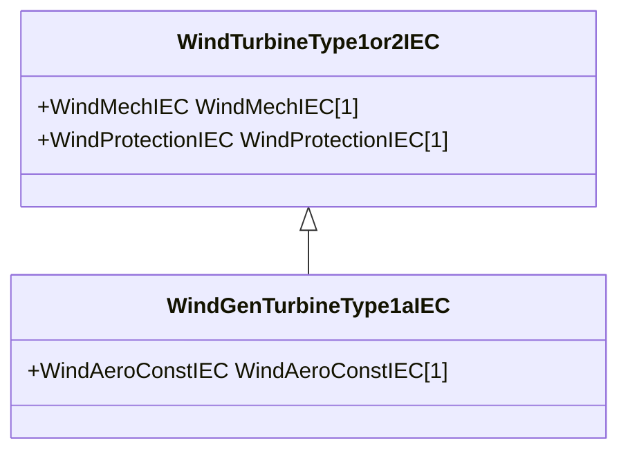

# WindGenTurbineType1aIEC

Wind turbine IEC type 1A. Reference: IEC 61400-27-1:2015, 5.5.2.2.

## Inheritance

<button class="mermaid-enlarge-button">Enlarge Diagram</button>

## Attributes

| Label | Type | Multiplicity | Comment |
|-------|------|--------------|---------|
| WindAeroConstIEC | [WindAeroConstIEC](WindAeroConstIEC.md) | 1 | Wind aerodynamic model associated with this wind turbine type 1A model. |

