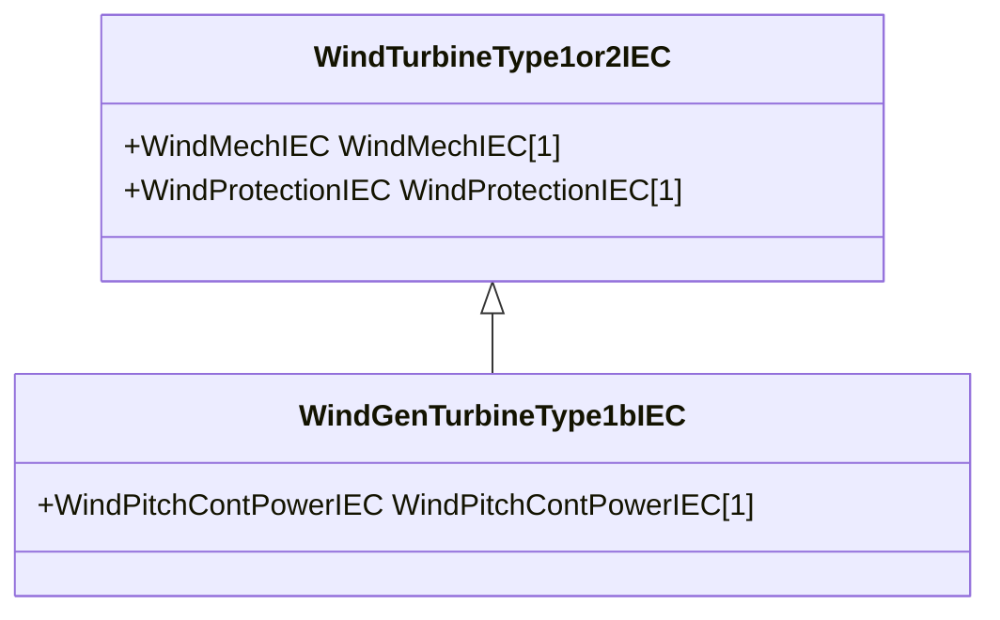

# WindGenTurbineType1bIEC

Wind turbine IEC type 1B. Reference: IEC 61400-27-1:2015, 5.5.2.3.

## Inheritance

<button class="mermaid-enlarge-button">Enlarge Diagram</button>

## Attributes

| Label | Type | Multiplicity | Comment |
|-------|------|--------------|---------|
| WindPitchContPowerIEC | [WindPitchContPowerIEC](WindPitchContPowerIEC.md) | 1 | Pitch control power model associated with this wind turbine type 1B model. |

