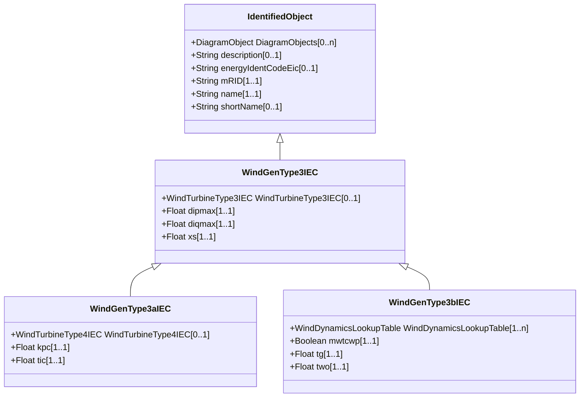

# WindGenType3IEC

Parent class supporting relationships to IEC wind turbines type 3 generator models of IEC type 3A and 3B.

## Inheritance

<button class="mermaid-enlarge-button">Enlarge Diagram</button>

## Attributes

| Label | Type | Multiplicity | Comment |
|-------|------|--------------|---------|
| WindTurbineType3IEC | [WindTurbineType3IEC](WindTurbineType3IEC.md) | 0..1 | Wind turbine type 3 model with which this wind generator type 3 is associated. |
| dipmax | Float | 1..1 | Maximum active current ramp rate (dipmax). It is a project-dependent parameter. |
| diqmax | Float | 1..1 | Maximum reactive current ramp rate (diqmax). It is a project-dependent parameter. |
| xs | Float | 1..1 | Electromagnetic transient reactance (xS). It is a type-dependent parameter. |

