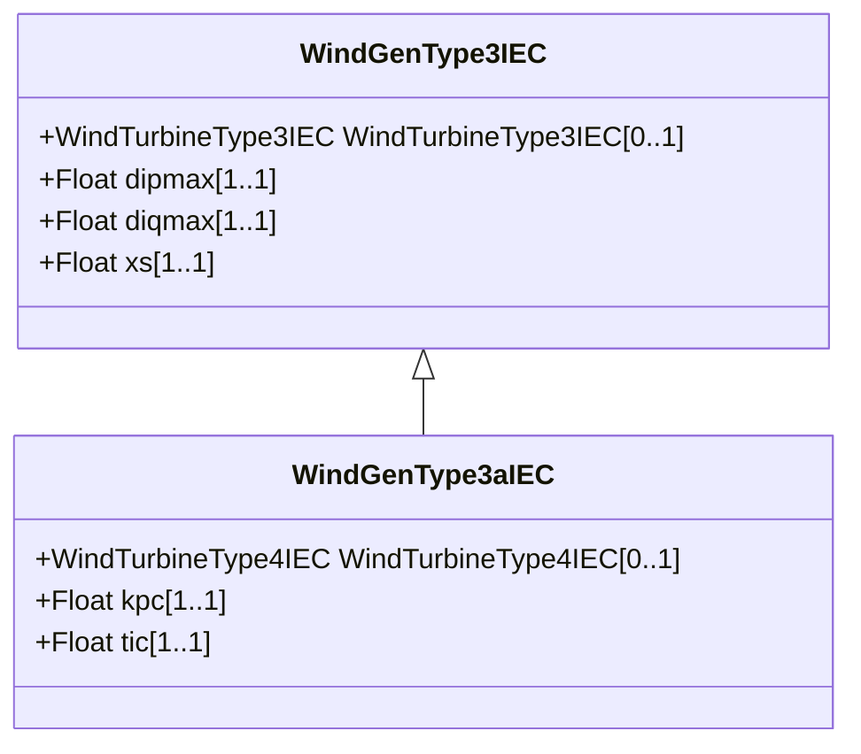

# WindGenType3aIEC

IEC type 3A generator set model. Reference: IEC 61400-27-1:2015, 5.6.3.2.

## Inheritance

<button class="mermaid-enlarge-button">Enlarge Diagram</button>

## Attributes

| Label | Type | Multiplicity | Comment |
|-------|------|--------------|---------|
| WindTurbineType4IEC | [WindTurbineType4IEC](WindTurbineType4IEC.md) | 0..1 | Wind turbine type 4 model with which this wind generator type 3A model is associated. |
| kpc | Float | 1..1 | Current PI controller proportional gain (KPc). It is a type-dependent parameter. |
| tic | Float | 1..1 | Current PI controller integration time constant (TIc) (>= 0). It is a type-dependent parameter. |

