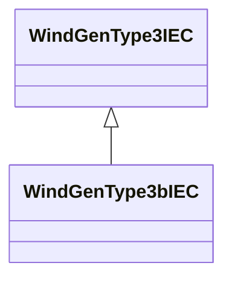

# WindGenType3bIEC

IEC type 3B generator set model. Reference: IEC 61400-27-1:2015, 5.6.3.3.

## Inheritance

<button class="mermaid-enlarge-button">Enlarge Diagram</button>

## Attributes

| Label | Type | Multiplicity | Comment |
|-------|------|--------------|---------|
| WindDynamicsLookupTable | [WindDynamicsLookupTable](WindDynamicsLookupTable.md) | 1..n | The wind dynamics lookup table associated with this generator type 3B model. |
| mwtcwp | Boolean | 1..1 | Crowbar control mode (MWTcwp). It is a case-dependent parameter. true = 1 in the IEC model false = 0 in the IEC model. |
| tg | Float | 1..1 | Current generation time constant (Tg) (>= 0). It is a type-dependent parameter. |
| two | Float | 1..1 | Time constant for crowbar washout filter (Two) (>= 0). It is a case-dependent parameter. |

