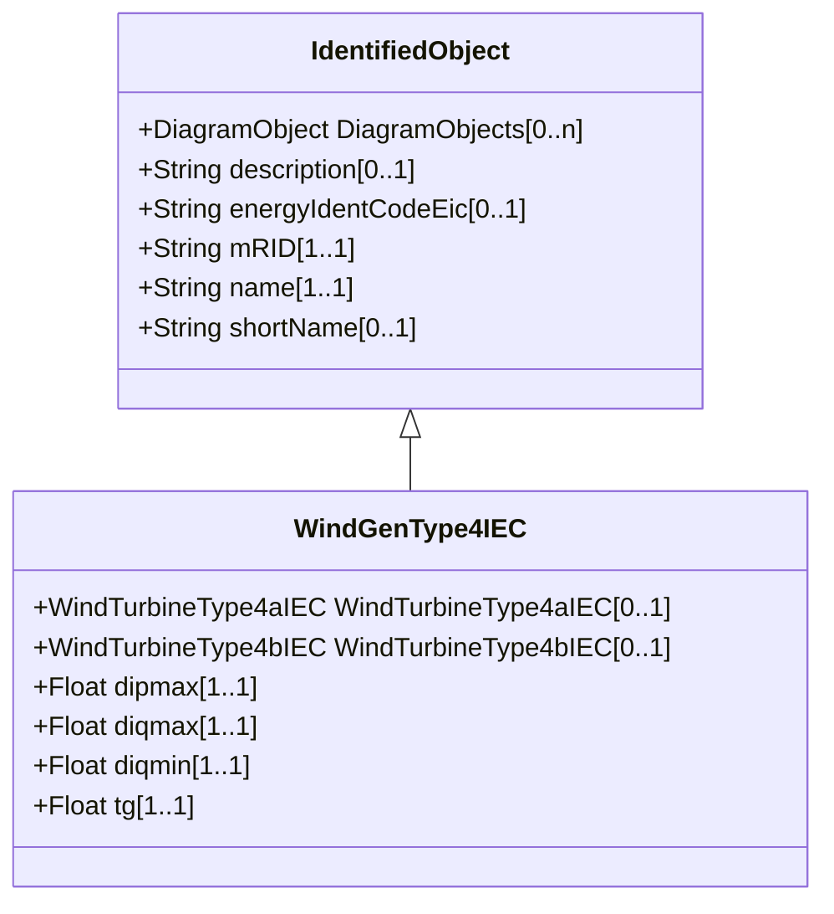

# WindGenType4IEC

IEC type 4 generator set model. Reference: IEC 61400-27-1:2015, 5.6.3.4.

## Inheritance

<button class="mermaid-enlarge-button">Enlarge Diagram</button>

## Attributes

| Label | Type | Multiplicity | Comment |
|-------|------|--------------|---------|
| WindTurbineType4aIEC | [WindTurbineType4aIEC](WindTurbineType4aIEC.md) | 0..1 | Wind turbine type 4A model with which this wind generator type 4 model is associated. |
| WindTurbineType4bIEC | [WindTurbineType4bIEC](WindTurbineType4bIEC.md) | 0..1 | Wind turbine type 4B model with which this wind generator type 4 model is associated. |
| dipmax | Float | 1..1 | Maximum active current ramp rate (dipmax). It is a project-dependent parameter. |
| diqmax | Float | 1..1 | Maximum reactive current ramp rate (diqmax). It is a project-dependent parameter. |
| diqmin | Float | 1..1 | Minimum reactive current ramp rate (diqmin). It is a project-dependent parameter. |
| tg | Float | 1..1 | Time constant (Tg) (>= 0). It is a type-dependent parameter. |

