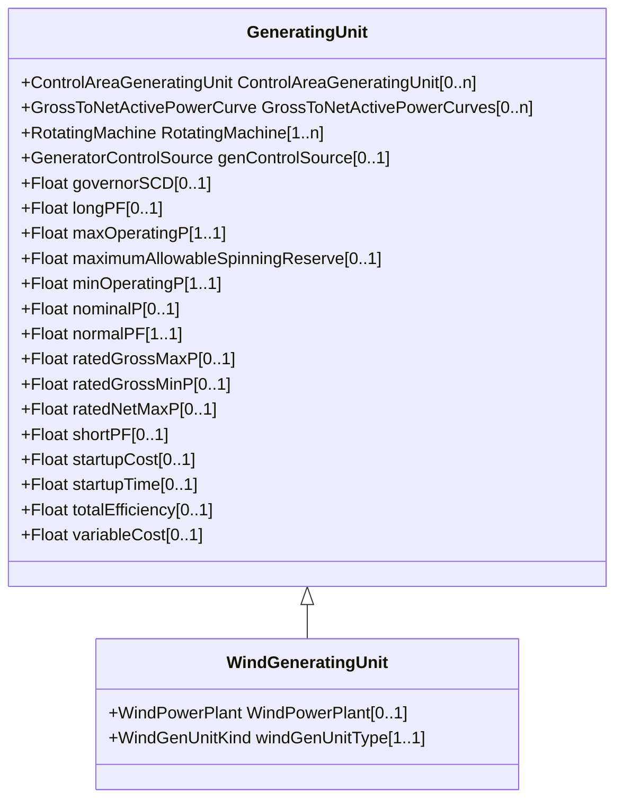

# WindGeneratingUnit

A wind driven generating unit, connected to the grid by means of a rotating machine. May be used to represent a single turbine or an aggregation.

## Inheritance

<button class="mermaid-enlarge-button">Enlarge Diagram</button>

## Attributes

| Label | Type | Multiplicity | Comment |
|-------|------|--------------|---------|
| WindPowerPlant | [WindPowerPlant](WindPowerPlant.md) | 0..1 | A wind power plant may have wind generating units. |
| windGenUnitType | [WindGenUnitKind](WindGenUnitKind.md) | 1..1 | The kind of wind generating unit. |

