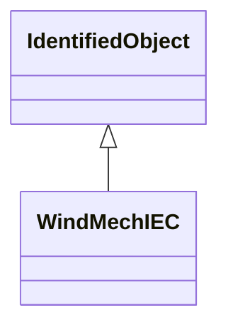

# WindMechIEC

Two mass model. Reference: IEC 61400-27-1:2015, 5.6.2.1.

## Inheritance

<button class="mermaid-enlarge-button">Enlarge Diagram</button>

## Attributes

| Label | Type | Multiplicity | Comment |
|-------|------|--------------|---------|
| WindTurbineType1or2IEC | [WindTurbineType1or2IEC](WindTurbineType1or2IEC.md) | 0..1 | Wind generator type 1 or type 2 model with which this wind mechanical model is associated. |
| WindTurbineType3IEC | [WindTurbineType3IEC](WindTurbineType3IEC.md) | 0..1 | Wind turbine type 3 model with which this wind mechanical model is associated. |
| WindTurbineType4bIEC | [WindTurbineType4bIEC](WindTurbineType4bIEC.md) | 0..1 | Wind turbine type 4B model with which this wind mechanical model is associated. |
| cdrt | Float | 1..1 | Drive train damping (cdrt). It is a type-dependent parameter. |
| hgen | Float | 1..1 | Inertia constant of generator (Hgen) (>= 0). It is a type-dependent parameter. |
| hwtr | Float | 1..1 | Inertia constant of wind turbine rotor (HWTR) (>= 0). It is a type-dependent parameter. |
| kdrt | Float | 1..1 | Drive train stiffness (kdrt). It is a type-dependent parameter. |

