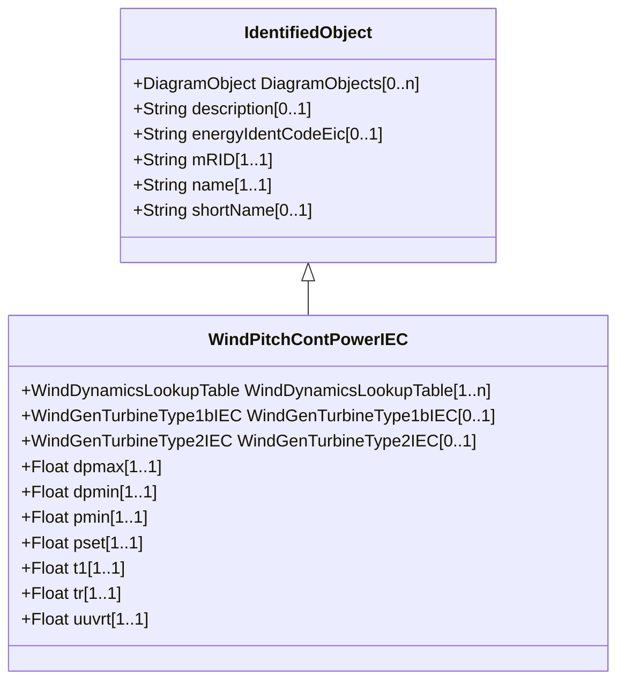

# WindPitchContPowerIEC

Pitch control power model. Reference: IEC 61400-27-1:2015, 5.6.5.1.

## Inheritance

<button class="mermaid-enlarge-button">Enlarge Diagram</button>

## Attributes

| Label | Type | Multiplicity | Comment |
|-------|------|--------------|---------|
| WindDynamicsLookupTable | [WindDynamicsLookupTable](WindDynamicsLookupTable.md) | 1..n | The wind dynamics lookup table associated with this pitch control power model. |
| WindGenTurbineType1bIEC | [WindGenTurbineType1bIEC](WindGenTurbineType1bIEC.md) | 0..1 | Wind turbine type 1B model with which this pitch control power model is associated. |
| WindGenTurbineType2IEC | [WindGenTurbineType2IEC](WindGenTurbineType2IEC.md) | 0..1 | Wind turbine type 2 model with which this pitch control power model is associated. |
| dpmax | Float | 1..1 | Rate limit for increasing power (dpmax) (> WindPitchContPowerIEC.dpmin). It is a type-dependent parameter. |
| dpmin | Float | 1..1 | Rate limit for decreasing power (dpmin) (< WindPitchContPowerIEC.dpmax). It is a type-dependent parameter. |
| pmin | Float | 1..1 | Minimum power setting (pmin). It is a type-dependent parameter. |
| pset | Float | 1..1 | If pinit < pset then power will be ramped down to pmin. It is (pset) in the IEC 61400-27-1:2015. It is a type-dependent parameter. |
| t1 | Float | 1..1 | Lag time constant (T1) (>= 0). It is a type-dependent parameter. |
| tr | Float | 1..1 | Voltage measurement time constant (Tr) (>= 0). It is a type-dependent parameter. |
| uuvrt | Float | 1..1 | Dip detection threshold (uUVRT). It is a type-dependent parameter. |

