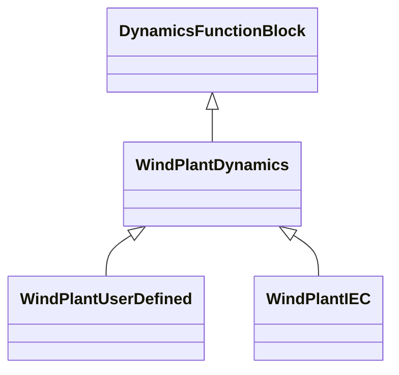

# WindPlantDynamics

Parent class supporting relationships to wind turbines type 3 and type 4 and wind plant IEC and user-defined wind plants including their control models.

## Inheritance

<button class="mermaid-enlarge-button">Enlarge Diagram</button>

## Attributes

| Label | Type | Multiplicity | Comment |
|-------|------|--------------|---------|
| RemoteInputSignal | [RemoteInputSignal](RemoteInputSignal.md) | 0..1 | The remote signal with which this power plant is associated. |
| WindTurbineType3or4Dynamics | [WindTurbineType3or4Dynamics](WindTurbineType3or4Dynamics.md) | 1..n | The wind turbine type 3 or type 4 associated with this wind plant. |

