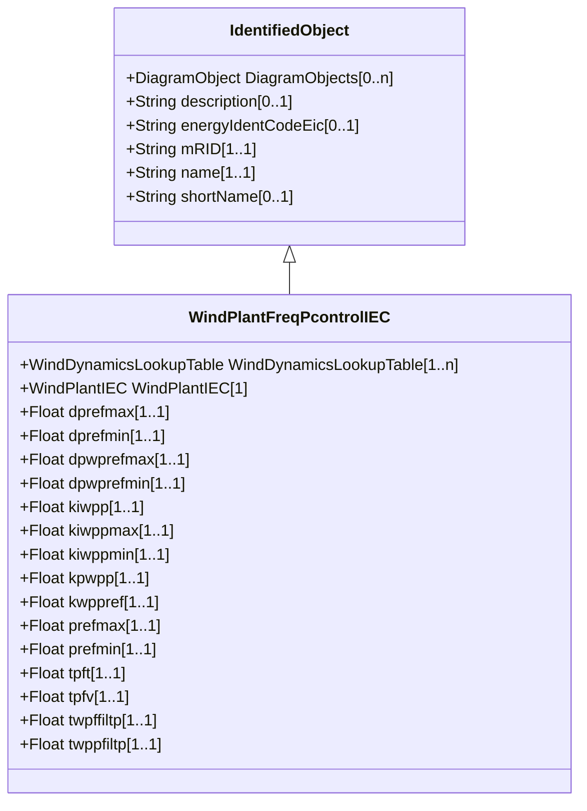

# WindPlantFreqPcontrolIEC

Frequency and active power controller model. Reference: IEC 61400-27-1:2015, Annex D.

## Inheritance

<button class="mermaid-enlarge-button">Enlarge Diagram</button>

## Attributes

| Label | Type | Multiplicity | Comment |
|-------|------|--------------|---------|
| WindDynamicsLookupTable | [WindDynamicsLookupTable](WindDynamicsLookupTable.md) | 1..n | The wind dynamics lookup table associated with this frequency and active power wind plant model. |
| WindPlantIEC | [WindPlantIEC](WindPlantIEC.md) | 1 | Wind plant model with which this wind plant frequency and active power control is associated. |
| dprefmax | Float | 1..1 | Maximum ramp rate of pWTref request from the plant controller to the wind turbines (dprefmax) (> WindPlantFreqPcontrolIEC.dprefmin). It is a case-dependent parameter. |
| dprefmin | Float | 1..1 | Minimum (negative) ramp rate of pWTref request from the plant controller to the wind turbines (dprefmin) (< WindPlantFreqPcontrolIEC.dprefmax). It is a project-dependent parameter. |
| dpwprefmax | Float | 1..1 | Maximum positive ramp rate for wind plant power reference (dpWPrefmax) (> WindPlantFreqPcontrolIEC.dpwprefmin). It is a project-dependent parameter. |
| dpwprefmin | Float | 1..1 | Maximum negative ramp rate for wind plant power reference (dpWPrefmin) (< WindPlantFreqPcontrolIEC.dpwprefmax). It is a project-dependent parameter. |
| kiwpp | Float | 1..1 | Plant P controller integral gain (KIWPp). It is a project-dependent parameter. |
| kiwppmax | Float | 1..1 | Maximum PI integrator term (KIWPpmax) (> WindPlantFreqPcontrolIEC.kiwppmin). It is a project-dependent parameter. |
| kiwppmin | Float | 1..1 | Minimum PI integrator term (KIWPpmin) (< WindPlantFreqPcontrolIEC.kiwppmax). It is a project-dependent parameter. |
| kpwpp | Float | 1..1 | Plant P controller proportional gain (KPWPp). It is a project-dependent parameter. |
| kwppref | Float | 1..1 | Power reference gain (KWPpref). It is a project-dependent parameter. |
| prefmax | Float | 1..1 | Maximum pWTref request from the plant controller to the wind turbines (prefmax) (> WindPlantFreqPcontrolIEC.prefmin). It is a project-dependent parameter. |
| prefmin | Float | 1..1 | Minimum pWTref request from the plant controller to the wind turbines (prefmin) (< WindPlantFreqPcontrolIEC.prefmax). It is a project-dependent parameter. |
| tpft | Float | 1..1 | Lead time constant in reference value transfer function (Tpft) (>= 0). It is a project-dependent parameter. |
| tpfv | Float | 1..1 | Lag time constant in reference value transfer function (Tpfv) (>= 0). It is a project-dependent parameter. |
| twpffiltp | Float | 1..1 | Filter time constant for frequency measurement (TWPffiltp) (>= 0). It is a project-dependent parameter. |
| twppfiltp | Float | 1..1 | Filter time constant for active power measurement (TWPpfiltp) (>= 0). It is a project-dependent parameter. |

