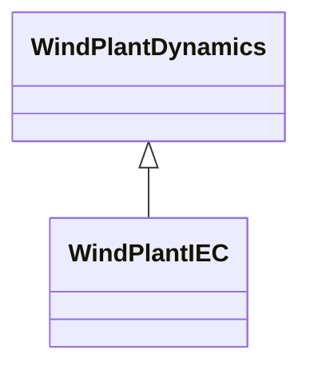

# WindPlantIEC

Simplified IEC type plant level model. Reference: IEC 61400-27-1:2015, Annex D.

## Inheritance

<button class="mermaid-enlarge-button">Enlarge Diagram</button>

## Attributes

| Label | Type | Multiplicity | Comment |
|-------|------|--------------|---------|
| WindPlantFreqPcontrolIEC | [WindPlantFreqPcontrolIEC](WindPlantFreqPcontrolIEC.md) | 1 | Wind plant frequency and active power control model associated with this wind plant. |
| WindPlantReactiveControlIEC | [WindPlantReactiveControlIEC](WindPlantReactiveControlIEC.md) | 1 | Wind plant model with which this wind reactive control is associated. |

