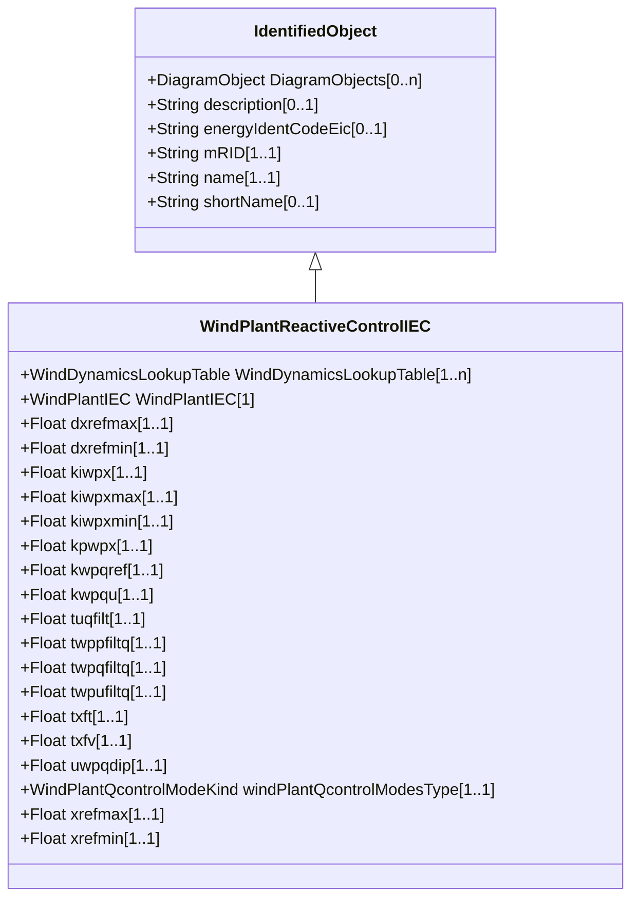

# WindPlantReactiveControlIEC

Simplified plant voltage and reactive power control model for use with type 3 and type 4 wind turbine models. Reference: IEC 61400-27-1:2015, Annex D.

## Inheritance

<button class="mermaid-enlarge-button">Enlarge Diagram</button>

## Attributes

| Label | Type | Multiplicity | Comment |
|-------|------|--------------|---------|
| WindDynamicsLookupTable | [WindDynamicsLookupTable](WindDynamicsLookupTable.md) | 1..n | The wind dynamics lookup table associated with this voltage and reactive power wind plant model. |
| WindPlantIEC | [WindPlantIEC](WindPlantIEC.md) | 1 | Wind plant reactive control model associated with this wind plant. |
| dxrefmax | Float | 1..1 | Maximum positive ramp rate for wind turbine reactive power/voltage reference (dxrefmax) (> WindPlantReactiveControlIEC.dxrefmin). It is a project-dependent parameter. |
| dxrefmin | Float | 1..1 | Maximum negative ramp rate for wind turbine reactive power/voltage reference (dxrefmin) (< WindPlantReactiveControlIEC.dxrefmax). It is a project-dependent parameter. |
| kiwpx | Float | 1..1 | Plant Q controller integral gain (KIWPx). It is a project-dependent parameter. |
| kiwpxmax | Float | 1..1 | Maximum reactive power/voltage reference from integration (KIWPxmax) (> WindPlantReactiveControlIEC.kiwpxmin). It is a project-dependent parameter. |
| kiwpxmin | Float | 1..1 | Minimum reactive power/voltage reference from integration (KIWPxmin) (< WindPlantReactiveControlIEC.kiwpxmax). It is a project-dependent parameter. |
| kpwpx | Float | 1..1 | Plant Q controller proportional gain (KPWPx). It is a project-dependent parameter. |
| kwpqref | Float | 1..1 | Reactive power reference gain (KWPqref). It is a project-dependent parameter. |
| kwpqu | Float | 1..1 | Plant voltage control droop (KWPqu). It is a project-dependent parameter. |
| tuqfilt | Float | 1..1 | Filter time constant for voltage-dependent reactive power (Tuqfilt) (>= 0). It is a project-dependent parameter. |
| twppfiltq | Float | 1..1 | Filter time constant for active power measurement (TWPpfiltq) (>= 0). It is a project-dependent parameter. |
| twpqfiltq | Float | 1..1 | Filter time constant for reactive power measurement (TWPqfiltq) (>= 0). It is a project-dependent parameter. |
| twpufiltq | Float | 1..1 | Filter time constant for voltage measurement (TWPufiltq) (>= 0). It is a project-dependent parameter. |
| txft | Float | 1..1 | Lead time constant in reference value transfer function (Txft) (>= 0). It is a project-dependent parameter. |
| txfv | Float | 1..1 | Lag time constant in reference value transfer function (Txfv) (>= 0). It is a project-dependent parameter. |
| uwpqdip | Float | 1..1 | Voltage threshold for UVRT detection in Q control (uWPqdip). It is a project-dependent parameter. |
| windPlantQcontrolModesType | [WindPlantQcontrolModeKind](WindPlantQcontrolModeKind.md) | 1..1 | Reactive power/voltage controller mode (MWPqmode). It is a case-dependent parameter. |
| xrefmax | Float | 1..1 | Maximum xWTref (qWTref or delta uWTref) request from the plant controller (xrefmax) (> WindPlantReactiveControlIEC.xrefmin). It is a case-dependent parameter. |
| xrefmin | Float | 1..1 | Minimum xWTref (qWTref or delta uWTref) request from the plant controller (xrefmin) (< WindPlantReactiveControlIEC.xrefmax). It is a project-dependent parameter. |

