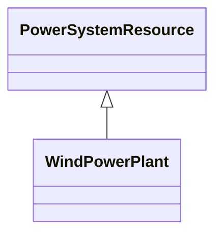

# WindPowerPlant

Wind power plant.

## Inheritance

<button class="mermaid-enlarge-button">Enlarge Diagram</button>

## Attributes

| Label | Type | Multiplicity | Comment |
|-------|------|--------------|---------|
| WindGeneratingUnits | [WindGeneratingUnit](WindGeneratingUnit.md) | 0..n | A wind generating unit or units may be a member of a wind power plant. |

